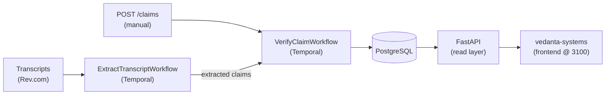
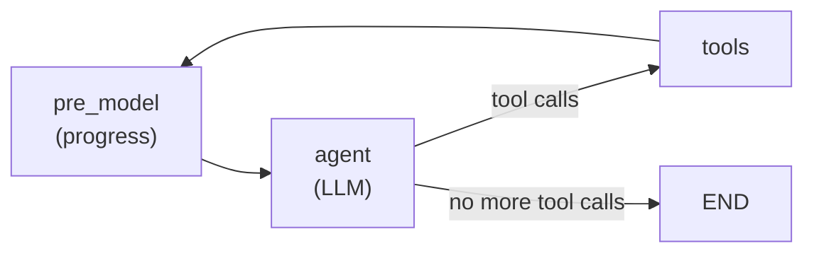
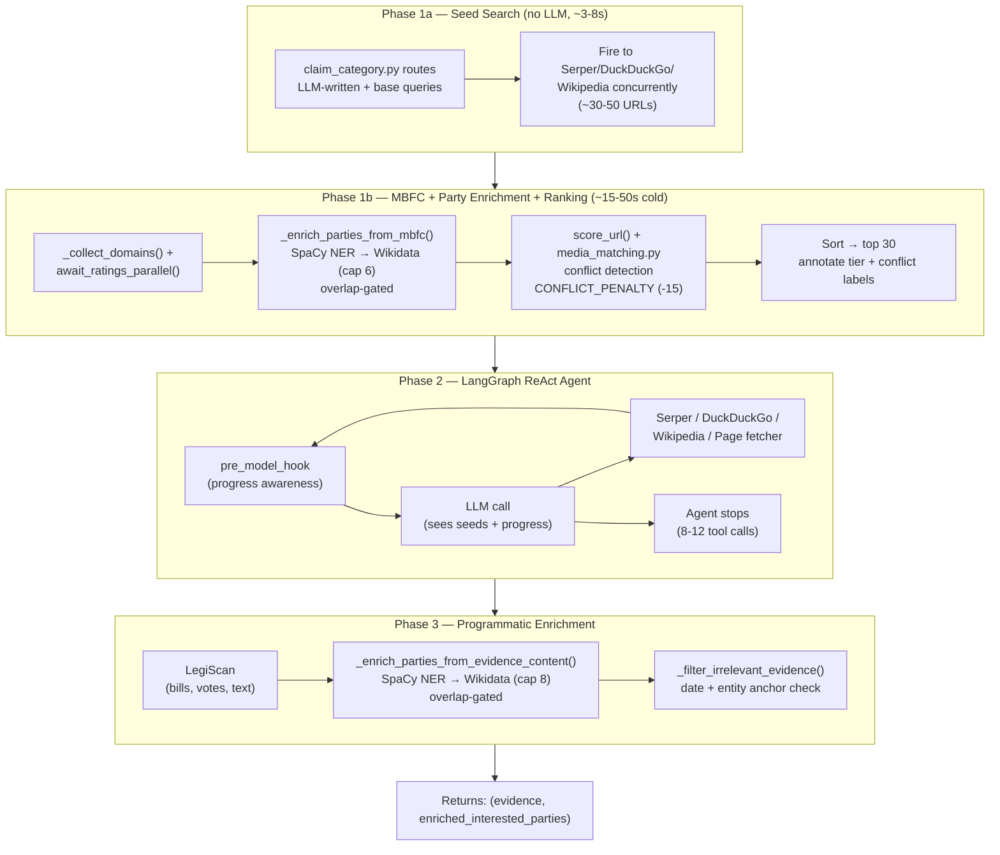
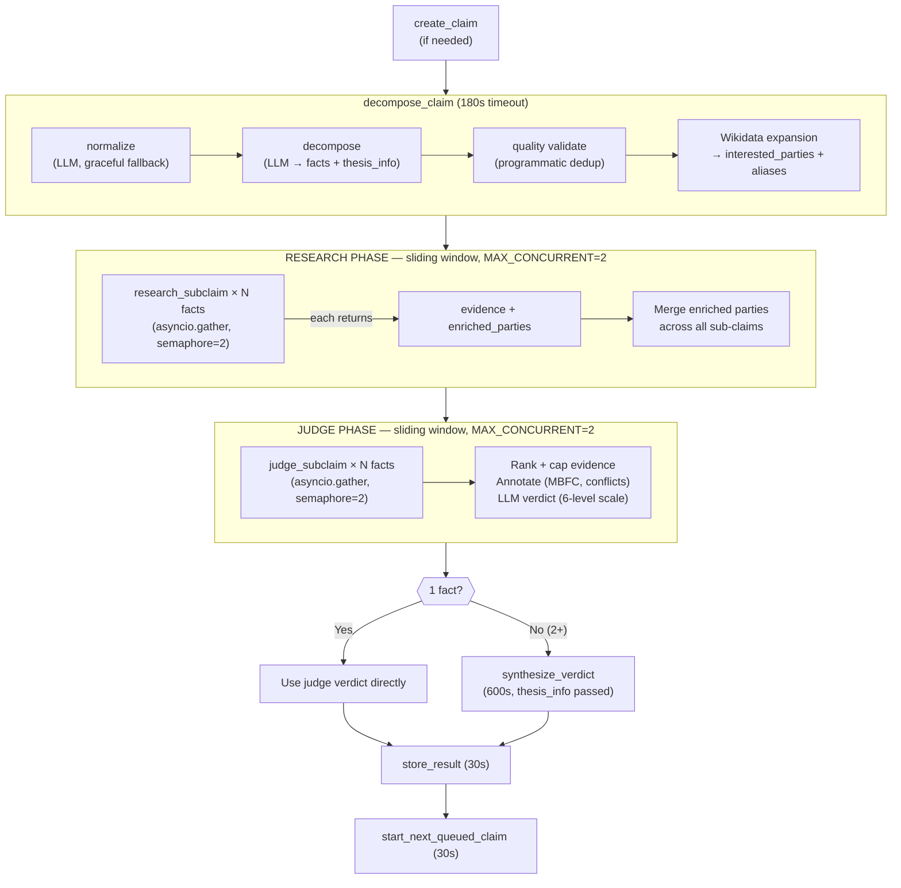
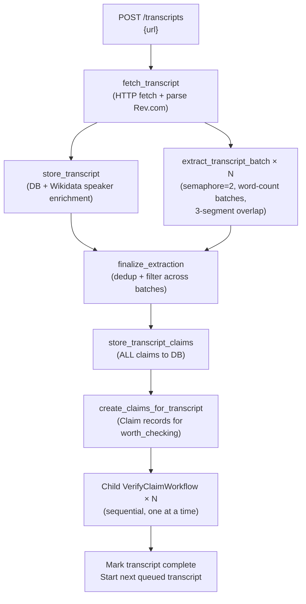
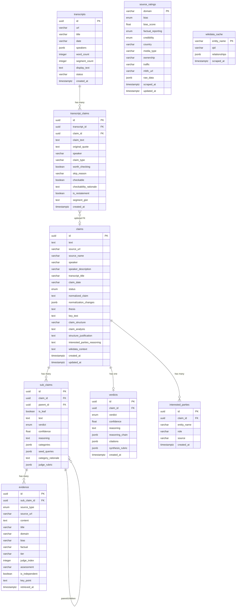
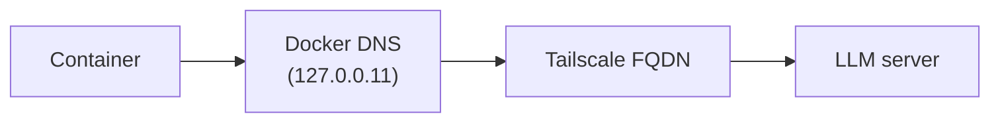
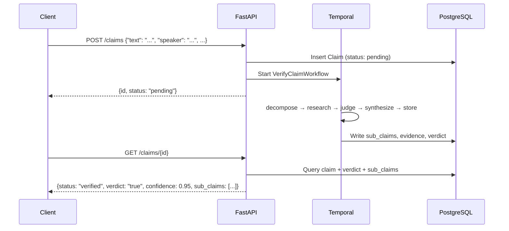

# Architecture

## System Context

Spin Cycle is an automated news claim verification system. The goal: take verifiable factual claims from the news, decompose them into atomic sub-claims, research real evidence using web tools, and deliver structured verdicts with full reasoning chains.



The primary intake is **transcript extraction** — Temporal workflows fetch transcripts from Rev.com, the LLM extracts verifiable claims, and each claim is fed into the verification pipeline. The FastAPI backend is a **read layer** for the frontend, with a secondary `POST /claims` for manual submission.

---

## How the Stack Fits Together

There are three major technologies in play, each doing a different job. Understanding what each one handles (and doesn't handle) is key.

### LangChain (foundation layer)

LangChain is the **toolbox**. It provides:

- **`ChatOpenAI`** — the LLM client that talks to the LLM server's OpenAI-compatible API. Every LLM call in the project goes through this class. It handles message formatting, streaming, structured output, and tool calling.
- **LangChain tools** — standardised interfaces for external services. Serper (Google), DuckDuckGo, Wikipedia, Brave, and page fetching are all wrapped as LangChain tools with a common `.invoke()` / `.ainvoke()` API.
- **Message types** — `SystemMessage`, `HumanMessage`, `AIMessage`, `ToolMessage`. These are the primitives that make up an LLM conversation.

LangChain does NOT handle orchestration, retries, scheduling, or state persistence. It's the building blocks.

**Where it's used:**
- `src/llm/` — LLM client package: `client.py` (ChatOpenAI config), `invoker.py` (invoke + parse + validate + retry), `parser.py` (JSON extraction), `validators.py` (semantic validators per step)
- `src/tools/web_search.py` — `DuckDuckGoSearchResults` tool
- `src/tools/wikipedia.py` — custom `@tool`-decorated async function
- `src/agent/decompose.py`, `src/agent/judge.py`, `src/agent/synthesize.py` — domain logic calling `invoke_llm()` with Pydantic schemas from `src/schemas/llm_outputs.py`
- `src/activities/verify_activities.py` — thin Temporal wrappers delegating to agent modules

### LangGraph (agent framework)

LangGraph is the **agent engine**. It builds on LangChain to create state machines with:

- **Cycles**: a node can loop back to a previous node (research → evaluate → need more → research again)
- **Tool calling**: the LLM decides which tools to call, the graph executes them, feeds results back
- **State persistence**: every step reads from and writes to a typed state object

The critical pattern in Spin Cycle is the **ReAct (Reason + Act) agent** with progress awareness:



1. **Pre-model hook** analyzes the conversation so far — counting tool calls, unique URLs, search queries, engines tried — and injects a progress summary into the LLM's system message (ephemeral, doesn't modify state)
2. LLM receives the conversation + tool definitions + progress note
3. LLM decides to call a tool → returns an `AIMessage` with `tool_calls`
4. Graph executes the tool → appends `ToolMessage` with results
5. Loop back to pre_model → agent. The progress note updates each iteration, giving the agent real-time awareness of what it has
6. LLM decides it has enough → returns a text response → graph ends

This is what makes the research step **agentic** — the LLM autonomously decides what to search, reads results, knows what it's already tried (via progress), and adapts its strategy.

**Where it's used:**
- `src/agent/research.py` — `create_react_agent()` builds the ReAct agent with `pre_model_hook=_research_pre_model_hook`

### Temporal (durable workflow orchestration)

Temporal is the **scheduler and reliability layer**. It handles:

- **Durable execution**: if a container crashes mid-workflow, Temporal replays from the last completed activity
- **Retries**: each activity has a `RetryPolicy` (max 3 attempts). If the LLM times out, Temporal retries just that activity
- **Timeouts**: activities have `start_to_close_timeout` (15-420s). Research gets 420s (agent loops); judge/synthesize get 300s. Loops that run forever get killed
- **Scheduling**: extraction workflows will run on a Temporal cron schedule (every 15 min)
- **Visibility**: Temporal UI shows every workflow, its state, its history. Debug anything

The key insight: **LangGraph runs inside Temporal activities, not instead of them.**



Temporal handles the **macro orchestration** (decompose → research → judge → synthesize → store). LangGraph handles the **micro orchestration** (search → read → decide → search more).

**Where it's used:**
- `src/workflows/verify.py` — `VerifyClaimWorkflow` definition
- `src/activities/verify_activities.py` — all 7 Temporal activities
- `src/worker.py` — worker entrypoint that registers workflows + activities
- `docker-compose.dev.yml` — Temporal server + Temporal UI containers

---

## The Verification Pipeline (what's working now)

A claim enters the system (via API or extraction) and is processed as a **flat pipeline of atomic facts**, orchestrated by Temporal with 7 activities. Inspired by Google DeepMind's SAFE (NeurIPS 2024) and FActScore — factual claims are flat structures, not hierarchical trees.

### Model Assignment

All steps use the same **Qwen3.5-122B-A10B** (MoE, 10B active) instance on the LLM server, running on **ROCm** for AMD GPU acceleration. Quantized to Q4_K_M (~76.5GB).

All steps use **instruct mode** (`enable_thinking=False`). Thinking mode was tested for judge and synthesize but reverted — see [Thinking Mode Experiment](#thinking-mode-experiment) below for details.

| Step | Mode | Why |
|------|------|-----|
| decompose_claim | instruct (temp=0) | Structured JSON output, no reasoning needed |
| research_subclaim | instruct (temp=0) | ReAct tool-routing — picking search queries |
| judge_subclaim | instruct (temp=0) | Structured rubric evaluation. Calibration rules in the prompt guide reasoning |
| synthesize_verdict | instruct (temp=0) | Thesis evaluation and subclaim weighting |

**Why instruct over thinking:** Thinking mode (Qwen3.5's `enable_thinking=True`) was tested but produced worse outcomes overall — 5-10 min per call (vs 1-2 min instruct), schema validation failures from creative enum values, and silent activity crashes. The prompt's calibration rules (outlet-vs-claim reliability, contested classifications, rhetorical trap detection patterns) achieve the same reasoning quality improvements at zero latency cost. See [Thinking Mode Experiment](#thinking-mode-experiment).

### Step 1: decompose_claim (normalize → flat facts + thesis)

**File:** `src/activities/verify_activities.py`
**Prompts:** `src/prompts/verification.py` → `NORMALIZE_SYSTEM` / `NORMALIZE_USER` + `DECOMPOSE_SYSTEM` / `DECOMPOSE_USER`

The decompose activity runs **2 LLM calls** internally (normalize + decompose), plus a programmatic quality check:

1. **Normalize** — rewrites the claim in neutral, researchable language (1 LLM call, max_retries=1). Performs 7 transformations grounded in the academic literature:
   - **Bias neutralization** (Pryzant et al. AAAI 2020) — loaded language → neutral equivalents
   - **Operationalization** — vague abstractions → measurable indicators
   - **Normative/factual separation** (VeriScore, GCC taxonomy) — opinions stripped, facts kept
   - **Coreference resolution** — pronouns → explicit referents
   - **Reference grounding** (SAFE decontextualization) — acronyms expanded, dates grounded
   - **Speculative language handling** (AmbiFC ambiguity taxonomy) — predictions flagged
   - **Rhetorical/sarcastic framing** — conditional: only when claim clearly uses irony, rhetorical questions, or sarcasm; converts to literal assertion

   If normalization fails, the raw claim is used as fallback (graceful degradation).

2. **Decompose** — extracts flat atomic facts + thesis from the normalized claim.

3. **Quality validate** — programmatic near-duplicate removal (punctuation, case, whitespace differences). Only runs when ≥2 sub-claims exist. The LLM semantic duplicate check was removed due to a 100% false positive rate that collapsed valid decompositions (e.g., "greatest" + "most powerful" merged into just "most powerful"). No LLM retry is triggered from this step.

The normalized claim and list of changes are stored in `thesis_info` for auditability.

The LLM extracts a **flat list of atomic facts** plus **thesis information** that captures the speaker's intent. This approach matches Google SAFE and FActScore — simple, direct fact extraction without template expansion.

```
Input:  "Country A spends over $800B on military, more than Country B at $200B.
         Both countries are increasing military spending while cutting foreign aid."

Output: {
  "thesis": "Country A and Country B both prioritize military over aid, with A spending more",
  "key_test": "A ~$800B, B ~$200B, A > B, AND both must be increasing
               military AND both must be cutting foreign aid",
  "structure": "parallel_comparison",
  "facts": [
    "Country A spends over $800 billion on its military",
    "Country B spends about $200 billion on its military",
    "Country A's military spending is greater than Country B's",
    "Country A is increasing its military spending",
    "Country B is increasing its military spending",
    "Country A is cutting its foreign aid budget",
    "Country B is cutting its foreign aid budget"
  ],
  "interested_parties": {
    "direct": ["Country A Government", "Country B Government"],
    "institutional": ["Country A Ministry of Defense", "Country B Ministry of Defense"],
    "affiliated_media": [],
    "reasoning": "Both governments are subjects of the claim"
  }
}
```

**Why flat facts instead of structured templates?**

The previous approach used `entities + predicates + applies_to` with `{entity}` placeholder templates that code would expand. This was over-engineered:
- Added complexity (template parsing, expansion logic)
- LLM often used wrong placeholder names
- The standard approach (Google SAFE, FActScore) just outputs a flat list

The current approach:
1. LLM outputs facts directly as strings — no templates, no expansion
2. 15 extraction rules in the decompose prompt guide decomposition (decontextualization, presuppositions, quantifiers, causation, etc.)
3. Thesis extraction captures speaker intent for synthesis

**Key extraction rules** in the decompose prompt guide the LLM to handle linguistic patterns including presupposition triggers, quantifier scope, modality, causation types, comparisons, negation, and more. These are embedded directly in `DECOMPOSE_SYSTEM`.

**Extraction rules 6-9** (added alongside normalization) address missing capabilities from the literature:

| Rule | What it does | Source |
|------|-------------|--------|
| **6. Decontextualize** | Each fact must stand alone — no dangling pronouns or implicit references | Google SAFE, Molecular Facts (Gunjal et al. 2024) |
| **7. Extract underlying question** | Loaded phrasing → factual question being asked | ClaimDecomp (Chen et al. EMNLP 2022) |
| **8. Entity disambiguation** | Add minimum context for unique identification | Molecular Facts (Gunjal et al. 2024) |
| **9. Operationalize comparisons** | Define comparison groups by shared trait, not vague similarity | — |
| **15. Embedded conclusions** | Separate factual assertions from causal/logical inferences drawn from them. Trigger words: "proving", "showing", "therefore", etc. | — |

The **decomposition checklist** now includes action directives (not just detection prompts) for vagueness operationalization, implicature extraction, speech act separation, causation preservation, and a new decontextualization quality check.

**The thesis extraction** captures the speaker's rhetorical intent:
- `thesis` — the argument the speaker is making
- `structure` — `simple`, `parallel_comparison`, `causal`, or `ranking`
- `key_test` — what must ALL be true for the thesis to hold

This is passed to the synthesizer so it evaluates whether the speaker's **argument** survives the evidence. Without this, a claim comparing two countries could be rated `mostly_true` if 5 of 6 facts check out — even if the one false fact (e.g., Country B NOT cutting aid) completely invalidates the speaker's parallel comparison.

**Interested parties extraction and expansion:**

The decompose step identifies parties with potential conflicts of interest through two layers:

1. **LLM extraction** — identifies direct parties, institutional connections, and reasoning
2. **SpaCy NER augmentation** — `en_core_web_sm` runs on the claim text to catch PERSON/ORG entities the LLM missed (deterministic, CPU-only, milliseconds)
3. **Wikidata expansion** — each party is programmatically expanded via SPARQL to discover:
   - Corporate ownership chains (subsidiaries, parent companies)
   - Media holdings (critical for source independence)
   - Political affiliations
   - Family relationships (2-hop: e.g., Person A → Spouse → Father-in-law)
   - Family members' corporate roles (founder, CEO, chairperson)

The expanded parties object includes:
- `direct`: Entities directly mentioned in the claim
- `institutional`: Parent organizations, governing bodies
- `affiliated_media`: Media outlets owned by or connected to interested parties
- `all_parties`: Full deduplicated list (used by judge for conflict detection)
- `wikidata_context`: Formatted text injected into judge and research prompts

**File:** `src/agent/decompose.py` → `expand_interested_parties()`
**File:** `src/tools/wikidata.py` → `get_ownership_chain()`, `collect_all_connected_parties()`
**File:** `src/utils/ner.py` → `extract_entities()` (SpaCy NER)

**LanguageTool grammar correction** runs on all LLM text outputs (facts, thesis, reasoning) to catch grammar oddities from quantized model outputs. Quantized LLMs sometimes produce valid-word substitutions that spell checkers miss (e.g., "priming" instead of "primary") — LanguageTool catches these because they create grammatically odd phrases even though each word is valid. The Java server lazy-loads on first use and runs locally inside the worker container.

**File:** `src/utils/text_cleanup.py` → `cleanup_text()` (LanguageTool)
**Applied in:** `decompose_claim` (facts, thesis), `extract_evidence` (content, title), `judge_subclaim` (reasoning), `synthesize_verdict` (reasoning)

All prompts include `Today's date: {current_date}` (formatted at call time) so the LLM knows the current date when evaluating temporal claims.

### Step 2: research_subclaim (the agentic part)

**File:** `src/agent/research.py` → `research_claim()`
**Called from:** `src/activities/verify_activities.py`
**Prompt:** `src/prompts/verification.py` → `RESEARCH_SYSTEM` / `RESEARCH_USER`

This is where the LangGraph ReAct agent runs. For each **atomic fact**:

1. **Pre-model hook** injects a progress note into the system message — tool call count, unique URLs found, search queries used, engines tried, strategic suggestions (e.g., "try Brave for source diversity", "fetch full articles from your best URLs")
2. Agent receives: "Find evidence about: {sub-claim}" + progress awareness
3. LLM decides what to search → calls any of the available tools
4. Tool executes the search → returns results as text
5. Loop back to pre_model → agent. Progress note updates each iteration
6. LLM reads results + progress → decides if it needs more → calls another tool or stops
7. Typically: 8-12 tool calls per sub-claim, 38 max agent steps
8. Agent timeout: 300s (soft), 420s (Temporal hard limit)
9. Max steps: 38 (each tool call costs ~3 steps: pre_model + agent + tools)

**Streaming evidence collection:** The agent uses `astream()` with `stream_mode="updates"` instead of `ainvoke()`. Messages are collected incrementally as the agent works. If the agent hits its step limit (`GraphRecursionError`) or times out, we keep ALL evidence gathered up to that point instead of losing everything. This replaced a direct `ainvoke()` call that would return nothing on interruption.

The research agent uses **thinking=off** (`enable_thinking=False`). The ReAct loop is pure tool-routing — picking search queries and deciding when to stop. Thinking mode wastes tokens per iteration generating `<think>` blocks that nobody reads, just to produce an 8-token tool call. With thinking off, the same search queries are produced in ~3s per iteration.

**Tools available to the agent (dynamically loaded based on API keys):**
- `serper_search` — Google search via Serper API (primary). Requires `SERPER_API_KEY`.
- `web_search` — DuckDuckGo search (fallback). Always available, free.
- `brave_search` — Brave Search API (optional). Requires `BRAVE_API_KEY`.
- `wikipedia_search` — Wikipedia API search (established facts, background).
- `page_fetcher` — Fetches and extracts text from URLs found in search results.

**Programmatic enrichment (NOT agent tools):**
- **MBFC → Wikidata enrichment** (runs BEFORE seed ranking) — After `await_ratings_parallel()` warms the MBFC cache, `_enrich_parties_from_mbfc()` extracts PERSON/ORG names from MBFC ownership strings via SpaCy NER (e.g., "Owned by Rupert Murdoch's News Corporation" → ["Rupert Murdoch", "News Corporation"]), then Wikidata-expands them in parallel (capped at 6). **Overlap-gated:** only adds when an MBFC owner's Wikidata graph intersects existing interested parties. When overlap is found, only the owner + their media holdings are added — not all subsidiaries, board members, or unrelated orgs. This prevents unrelated corporate trees (e.g., Thomson Reuters subsidiaries) from polluting the parties list on claims that have nothing to do with them. New parties/media influence conflict detection in subsequent seed ranking.
- **LegiScan** (runs after the agent finishes) — US legislation search. If the subclaim matches any legislation, appends bill details (sponsors, status, history), roll call votes (individual member positions), and bill text (the actual legislative language). The bill text enables the judge to detect "poison pills" — provisions slipped into otherwise popular bills that explain otherwise puzzling voting patterns. Requires `LEGISCAN_API_KEY`.
- **Evidence NER → Wikidata enrichment** (runs after LegiScan) — `_enrich_parties_from_evidence_content()` runs SpaCy NER on concatenated evidence article content, then Wikidata-expands new entities in parallel (capped at 8). **Overlap-gated** (same as MBFC enrichment): only adds if their Wikidata graph overlaps with existing interested parties.

**Design principle — overlap-gated enrichment:** Enrichment flows FROM claim parties OUTWARD, never from random sources inward. Both MBFC and evidence NER enrichment only add entities when their Wikidata graph intersects the claim's existing interested parties. This prevents unrelated corporate trees from polluting the parties list — e.g., Thomson Reuters subsidiaries appearing on a claim about Taiwan sovereignty because Reuters happened to be a seed source. When overlap IS found, only the owner + their media holdings are added (for conflict detection on news sources), not all subsidiaries, board members, or unrelated orgs.

**Return type:** `research_claim()` returns `tuple[list[dict], InterestedPartiesDict]` — both the evidence and enriched interested parties. The workflow merges enriched parties across all sub-claims and passes the merged set to the judge phase.

All search tools pass results through `source_filter.py` before returning — low-quality sources (Reddit, Quora, social media, content farms, etc.) are silently dropped. See **Source Quality Filtering** below.

**MBFC index bootstrap** (`src/tools/mbfc_index.py`) downloads the full MBFC source index (~10,300 records) from the WordPress REST API on startup, upserting into the `source_ratings` table. Subsequent lookups are instant DB SELECTs. The index refreshes every 7 days.

**Page fetcher entity extraction:** When the agent fetches a full article, SpaCy NER extracts PERSON/ORG entities from the content and includes them in the tool output (e.g., "Entities mentioned: Person A, Person B, Organization X"). This gives the agent visibility into who is quoted/mentioned without an additional LLM call.

The RESEARCH_SYSTEM prompt explicitly instructs the agent to prefer authoritative sources: government databases, wire services, established news outlets, academic institutions, official statistics agencies. It also includes three strategic search directives:
- **Search both sides** — after finding evidence leaning one direction, search for the opposite perspective
- **Comparative claims** — search for each side of a comparison independently instead of searching for the comparison as a whole (which produces opinion pieces instead of factual data)
- **Resolve position titles** — when a claim references a title ("head of Agency X"), first search to resolve who currently holds that position, then use the name in subsequent searches

After the agent finishes, we extract evidence from the conversation:
- Each `ToolMessage` becomes an evidence record (source_type: web/wikipedia)
- The agent's final `AIMessage` is NOT included — it's the agent's own interpretation, not primary evidence
- LegiScan enrichment appends legislative evidence items (no URL dedup against agent evidence — LegiScan returns structured data fundamentally different from web search)

**Fallback:** If the ReAct agent fails (tool calling issues, network errors) with no evidence gathered, we fall back to direct tool calls — no LLM reasoning, just search the claim text directly. Less targeted but still produces evidence. If the agent fails WITH partial evidence (common with step limit or timeout), we use that partial evidence instead of falling back.

### Step 3: judge_subclaim

**File:** `src/agent/judge.py` → `judge()`
**Activity wrapper:** `src/activities/verify_activities.py`
**Prompt:** `src/prompts/verification.py` → `JUDGE_SYSTEM` / `JUDGE_USER`

The LLM evaluates evidence for a single sub-claim. This is NOT agentic — it's a single LLM call with structured output. Uses **instruct mode** — the prompt's calibration rules (outlet-vs-claim reliability, qualified language detection, contested classification rules, rhetorical trap patterns) guide reasoning without the latency overhead of thinking mode. Calls typically take 1-2 minutes.

The critical constraint: **"Do NOT use your own knowledge."** The LLM must reason only from the evidence provided. This is what makes verdicts trustworthy — they're grounded in real, citable sources.

**Evidence and source quality scoring** (`src/utils/evidence_ranker.py`) serves two purposes:

1. **Seed ranking** (research phase): `score_url()` scores ~80-100 raw seed URLs by MBFC + TLD heuristics (gov TLD = 0 bonus). `tier_label()` produces human-readable labels ("TIER 1 (very high factual)", "TIER 2 (mostly factual)", "government" for unrated gov). `source_tier()` returns int 0-3 for code logic. Used by `_rank_and_filter_seeds()` to select top 30 seeds.

2. **Judge capping** (judge phase): `score_evidence()` scores full evidence items (URL quality + source type + content richness). `rank_and_select()` caps to 20 items with domain diversity.

URL-only scoring (`score_url` — used for seeds, max 40):

| Component | Range | Signals |
|-----------|-------|---------|
| MBFC factual | 0-30 | very-high=30, high=24, mostly-factual=16, unrated=4, unrated-gov=4 |
| Gov/institutional TLD | 0-10 | .gov/.mil=0 (no bonus), .edu=10 |
| MBFC credibility | 0-10 | high=10, medium=5, unrated=2 |

Full evidence scoring (`score_evidence` — used for judge, adds source_type + content):

| Component | Range | Signals |
|-----------|-------|---------|
| Source type | 0-30 | Wikipedia=30, LegiScan=28 (by URL), web=10 |
| Content richness | 0-30 | >2000 chars=30, >800=20, >200=10; <80 chars filtered out pre-ranking |
| + URL quality | 0-40 | (from score_url above) |

Domain diversity cap (max 3 items per domain) ensures at least 7 unique source domains. Gov/mil category cap: max 4 gov items per 20 evidence slots (excess removed, backfilled with non-gov). Political bias is deliberately NOT a scoring signal. Unrated sources get low defaults (factual=4, credibility=2) — unrated government domains score the same as unknown (no TLD bonus, GOV_TLD_SCORE=0). Gov sources must earn rank via MBFC rating. All scoring uses `get_source_rating_sync()` — cache-only, zero network calls.

**Pre-judge enrichment** is a lightweight cleanup pass. The heavy lifting (MBFC ownership → Wikidata, evidence NER → Wikidata) now happens in the research phase. The judge receives merged interested parties from all research sub-claims.

The judge still runs one pass: **Entity enrichment (SpaCy NER → Wikidata, parallel):** All evidence content is concatenated, SpaCy extracts PERSON/ORG entities, new entities not already in `all_parties` are Wikidata-expanded **in parallel** via `asyncio.gather` (capped at 8). If a newly discovered entity connects to an existing interested party, it's added to `all_parties` and its media holdings are added to `affiliated_media`. This catches entities from page fetches that weren't in the seed evidence.

Publisher ownership discovery (previously "Pass 2b" — domain → name heuristic → Wikidata) has been removed from the judge. Research now handles this via `_enrich_parties_from_mbfc()`, which uses real MBFC ownership data + SpaCy NER instead of domain-to-name guessing (~20-30% hit rate).

**6 conflict-of-interest checks** run per evidence item during `_annotate_evidence()`:

| # | Check | What it detects | Example |
|---|-------|----------------|---------|
| 0 | **Government source** | `.gov`/`.mil` domain | `⚠️ GOVERNMENT SOURCE: {domain} is a government website` |
| 1 | **Affiliated media** | Source URL matches media owned by interested party | Outlet X when its owner is in `all_parties` |
| 2 | **Quoted interested party** | Evidence content quotes statements from claim subjects (proximity-window attribution) | "FBI stated that..." when claim is about FBI conduct |
| 3 | **Publisher ownership** | Source publisher owned by interested party (via MBFC ownership field) | Outlet X when its owner is in `all_parties` |
| 4 | **Sub-source MBFC** | Evidence references another publication with poor factual rating or extreme bias | "according to [outlet]" → outlet has Mixed factual rating |
| 5 | **Authority relay** | Evidence derives from an interested party's own determination/designation/document (SpaCy dependency parsing) | `⚠️ AUTHORITY RELAY: evidence traces back to {party}'s own determination` |

Each check adds a `⚠️` warning to the evidence header that the LLM sees. The judge prompt has extensive instructions on how to handle self-serving statements, circular evidence, and interested party quotes — including specific patterns to reject and when to verdict "unverifiable."

**Source rating tags** from MBFC (Media Bias/Fact Check) are added to each evidence item:
- `[Center | Very High factual]` — bias and factual reporting rating
- `[Unrated source]` — domain not in MBFC database
- Bias distribution tracking warns if evidence skews heavily left or right

```
Input:  sub_claim = "Bitcoin was created by Satoshi Nakamoto in 2009"
        evidence = [Wikipedia excerpt, DuckDuckGo results]
Output: {"verdict": "true", "confidence": 0.95,
         "reasoning": "Multiple sources confirm..."}
```

Sub-claim verdicts: `true` | `mostly_true` | `mixed` | `mostly_false` | `false` | `partially_true` | `unverifiable`

The judge uses a **7-level verdict scale** with spirit-vs-substance guidance (the sub-claim enum includes `partially_true` for legacy compatibility):
- `true` — core assertion and key details are correct
- `mostly_true` — spirit is right, minor details off (e.g., "$50B" when the real figure is $48B)
- `mixed` — substantial parts both confirmed and contradicted
- `mostly_false` — core thrust is wrong, but contains some accurate elements
- `false` — directly contradicted by evidence
- `unverifiable` — insufficient evidence to determine

If there's no evidence, we short-circuit to "unverifiable" without calling the LLM.

**Special claim-type guidance in the judge prompt:**

| Guidance | What it handles |
|----------|----------------|
| **Quantitative claims** | Direction-based partial-data reasoning — if evidence supports the direction but exact figure is missing, use mostly_true not unverifiable |
| **Approximate comparatives** | Rankings that fluctuate by year/source — if direction is correct and claim is in the right ballpark, mostly_true |
| **Absence-of-evidence claims** | "No evidence exists", "no X has ever Y" — evaluate quality of search, not just counter-examples. Systematic reviews/authoritative body consensus IS evidence supporting absence. Supported absence → true/mostly_true, not unverifiable |
| **Viral/circular statistics** | Statistics repeated across many sources but all tracing to the same unverified original — repetition is not verification, treat as unverifiable |
| **Regulatory anomaly detection** | 5 patterns: carve-out suspicion, enforcement asymmetry, regulatory capture, letter vs spirit, precedent inconsistency |
| **Rhetorical trap detection** | Cherry-picking, correlation≠causation, definition games |

### Step 4: synthesize_verdict (thesis-aware synthesis)

**File:** `src/activities/verify_activities.py`
**Prompt:** `src/prompts/verification.py` → `SYNTHESIZE_SYSTEM` / `SYNTHESIZE_USER`

A single synthesis activity that combines sub-claim verdicts into an overall verdict. When thesis info is available (from the decompose step), the synthesizer evaluates whether the **speaker's argument** survives the sub-verdicts — not just whether a majority of facts are true.

```
Input:  claim_text = "Country A and Country B are both increasing military..."
        child_results = [
            {"sub_claim": "Country A increasing military spending", "verdict": "mostly_true", ...},
            {"sub_claim": "Country B increasing military spending", "verdict": "true", ...},
            {"sub_claim": "Country A cutting foreign aid", "verdict": "mostly_true", ...},
            {"sub_claim": "Country B cutting foreign aid", "verdict": "false", ...}
        ]
        thesis_info = {
            "thesis": "Country A and Country B are prioritizing military spending over foreign aid.",
            "structure": "parallel_comparison",
            "key_test": "Both countries must show increased military spending AND decreased foreign aid."
        }
        is_final = True
Output: {"verdict": "mostly_false", "confidence": 0.85,
         "reasoning": "The thesis requires both countries to be cutting foreign aid. Country B is actually increasing it, which undermines the core argument. Country A's part holds — increased military spending and reduced foreign aid, but the parallel comparison fails because Country B contradicts the thesis."}
```

The thesis is injected as a `SPEAKER'S THESIS` block in the synthesis prompt. The synthesizer is instructed to use the thesis as its **primary rubric** — evaluating whether THAT ARGUMENT survives the sub-verdicts, not whether a numerical majority of facts are true.

Why use LLM instead of averaging? Because "X happened in 2019 and cost $50M" where the event DID happen but in 2020 and cost $48M is "mostly true" — the core claim is right, details are slightly off. An LLM makes this nuance call better than math.

### Step 5: store_result

**File:** `src/activities/verify_activities.py`

Takes the result dict and writes it to Postgres:
- One `SubClaim` row per atomic fact (all `is_leaf=True` in the flat pipeline)
- One `Evidence` row per evidence item (source_type, content, URL) — linked to leaf sub-claims
- One `Verdict` row (overall verdict, confidence, reasoning)
- Updates `Claim.status` to "verified"

Evidence records with `source_type` not in the DB enum (`web`, `wikipedia`, `news_api`) are filtered out.

### Workflow Orchestration (flat pipeline)

The workflow processes claims in a flat pipeline — decompose once, then research ALL facts (Phase 1), then judge ALL facts (Phase 2), then synthesize. Research and judge are separate phases to prevent longer judge calls (structured rubric evaluation) from starving faster research agents.



Key properties:
- **Flat, not recursive** — one decompose call produces flat facts + thesis. Follows SAFE/FActScore.
- **Separate research + judge phases** — research all facts first, then judge all. Separated so the longer judge calls (structured rubric evaluation) don't starve faster research agents.
- **Sliding window concurrency** — semaphore-based, not batch-based. As one task finishes, the next starts immediately.
- **MAX_FACTS = 10** — caps decomposition output to prevent runaway processing.
- **MAX_CONCURRENT = 2** — matched to LLM server `--parallel 2`. Each agent gets a dedicated inference slot.
- **Thesis-aware** — decompose extracts speaker's intent (thesis, structure, key_test). key_test is passed to BOTH judge (per-subclaim) AND synthesis (overall claim). Single-fact claims that skip synthesis still get the key_test anchor.
- **Speaker enrichment** — Wikidata descriptions (role/title) are resolved once during transcript extraction and stored on the claim record. Standalone claims fall back to a Wikidata lookup in decompose. No redundant lookups.
- **Citation enforcement** — judge validator requires minimum 3 unique [N] citations per subclaim, synthesize validator requires minimum 5. Failures trigger LLM retries.
- **Streaming evidence** — agent uses `astream()` to collect evidence incrementally. Timeout or step limit preserves all evidence gathered so far.
- **Programmatic enrichment** — LegiScan, Wikidata, and MBFC all run deterministically (not as agent tools). MBFC ownership → Wikidata enrichment runs in research (before ranking). Evidence NER → Wikidata runs in research (after agent). Judge NER is a parallel cleanup pass.
- **Cross-sub-claim party merging** — enriched parties from each research sub-claim are merged (union) before the judge phase, so every sub-claim benefits from every other sub-claim's discoveries.
- **Single synthesis** — `synthesize_verdict` combines all fact-level judgments into one final verdict. Single-fact claims skip synthesis entirely.
- **Temporal retries per activity** — if one research call fails, only that activity retries (max 3 attempts).
- **Date-aware** — all prompts include `Today's date: {current_date}`.

### GPU Compute Constraints

The LLM runs via llama.cpp with **ROCm backend** (AMD GPU optimization). `--parallel N` slots multiplex concurrent requests onto a single GPU — it does NOT parallelize them. N concurrent requests = each takes ~Nx longer, total throughput is constant (~38 tok/s sustained).

| Service | Port | `--parallel` | `--ctx-size` | Backend | Notes |
|---------|------|-------------|-------------|---------|-------|
| Qwen3.5 | `:3101` | 2 | 131072 | ROCm | 2 slots x 65K context each. Thinking toggled per-request |
| Embedding | `:3103` | — | — | Vulkan | Disabled via Docker profiles (not currently used) |

The model's hybrid architecture (2 KV heads, 12 attention layers of 48 total — rest are recurrent/SSM) makes KV cache very cheap (~3 GB for both slots at full context).

`MAX_CONCURRENT=2` limits parallel research+judge pipelines, matched to the 2 LLM slots. Higher concurrency doesn't improve wall-clock time — it just increases per-request latency.

---

## Source Quality Filtering

**File:** `src/tools/source_filter.py`

All search results pass through a domain blocklist before reaching the research agent. This is a hard filter — blocked domains are silently dropped.

### Why?

Search engines return Reddit comments, Quora answers, Medium blogs, and other user-generated content that isn't citable for fact-checking. The LLM prompt also instructs the agent to prefer authoritative sources, but the code-level filter catches what the LLM might miss.

### Blocked Categories (~117 domains)

| Category | Examples | Reason |
|----------|----------|--------|
| Social media / forums | reddit.com, quora.com, twitter.com, facebook.com | User-generated, unvetted |
| Content farms | ehow.com, answers.com, reference.com | SEO-driven, not authoritative |
| Video platforms | youtube.com, vimeo.com, tiktok.com | Not citable text sources |
| Fact-check sites | snopes.com, politifact.com, factcheck.org | We do our own verification |
| Blog platforms | medium.com, substack.com | Mostly unvetted |
| AI aggregators | perplexity.ai, you.com | Not primary sources |
| Tabloids | dailymail.co.uk, thesun.co.uk, nypost.com, tmz.com | Sensationalist, unreliable |
| Partisan outlets | breitbart.com, infowars.com, dailywire.com, occupydemocrats.com | Ideological bias |
| State propaganda | rt.com, sputniknews.com | State-controlled media |
| Entertainment databases | imdb.com, rottentomatoes.com, metacritic.com, tvtropes.org | Not news or evidence sources |
| Medical/niche forums | flutrackers.com, mayoclinic.org, medscape.com, patient.info | Not journalism |
| Sports/weather/travel | espn.com, weather.com, accuweather.com, booking.com | Rarely evidence for claims |

### How It's Wired

- `filter_results(results)` — called in all search tools (Serper, Brave, DuckDuckGo) on the result list before returning
- `is_blocked(url)` — called in `page_fetcher.py` to reject blocked URLs before fetching
- Handles subdomains: `old.reddit.com` matches the `reddit.com` block
- Search tools request extra results (e.g., 15 instead of 10) to compensate for filtering losses

### Prompt-Level Reinforcement

The `RESEARCH_SYSTEM` prompt explicitly lists acceptable and forbidden source types, ranked in a **3-tier hierarchy**:

| Tier | Sources | Weight |
|------|---------|--------|
| **Tier 1 — Primary documents** | Treaties, charters, legislation, court filings, UN resolutions, official data (World Bank, SIPRI, BLS), academic papers | Strongest |
| **Tier 2 — Independent reporting** | Wire services (Reuters, AP), major outlets (BBC, NYT, Guardian), Wikipedia, think tanks | Strong |
| **Tier 3 — Interested-party statements** | Government websites (whitehouse.gov, state.gov, kremlin.ru), press releases, politician statements | Weakest — treated as claims, not facts |

The judge prompt mirrors this hierarchy: primary documents outweigh reporting, and both outweigh political statements. Government websites are explicitly flagged as communications arms of political actors, not neutral sources.

- **NEVER USE:** Reddit, Quora, social media, personal blogs, forums, YouTube comments, AI-generated summaries, fact-check sites (Snopes, PolitiFact)

---

## The Transcript Extraction Pipeline

The verification pipeline works end-to-end. Claim intake is via **transcript extraction** — Temporal workflows fetch transcripts from Rev.com, extract verifiable claims in segment batches, and auto-submit them to the verification queue.

### Design

`ExtractTranscriptWorkflow` processes a transcript URL through 5 phases:



**Key design decisions:**
- **One pipeline at a time** — extraction OR verification, not both (LLM server has 2 inference slots)
- **ALL claims stored** — including skipped ones with extraction metadata (worth_checking=false, skip_reason)
- **Programmatic filtering** — checkable AND NOT restatement AND NOT future_prediction
- **Speaker enrichment** — Wikidata resolves speaker descriptions once during `store_transcript`, passed down to all child verification workflows
- **Transcript claims → claims FK bridge** — `transcript_claims.claim_id` links to `claims.id` when a claim is sent to verification

See `docs/transcript-pipeline-plan.md` for the full design doc.

---

## Database Schema

### Entity Relationship Diagram



### Table: `claims`

The top-level entity. One row per claim submitted (manually or via transcript extraction).

| Column | Type | Constraints | Description |
|--------|------|-------------|-------------|
| `id` | `UUID` | PK, default uuid4 | Unique identifier |
| `text` | `TEXT` | NOT NULL | The original claim text |
| `source_url` | `VARCHAR(2048)` | nullable | URL where the claim was found |
| `source_name` | `VARCHAR(256)` | nullable | Name of the source (e.g., "BBC News") |
| `speaker` | `VARCHAR(256)` | nullable | Person who made the claim |
| `speaker_description` | `VARCHAR(512)` | nullable | Wikidata role/title (e.g., "45th president of the United States") |
| `claim_date` | `VARCHAR(64)` | nullable | When the claim was made (from transcript, article, etc.) |
| `transcript_title` | `VARCHAR(512)` | nullable | Source transcript title for topic context |
| `status` | `ENUM('queued','pending','processing','verified','flagged')` | NOT NULL, default 'pending' | Workflow state |
| `normalized_claim` | `TEXT` | nullable | Claim after bias-neutralization normalization |
| `normalization_changes` | `JSONB` | nullable | List of changes made during normalization |
| `thesis` | `TEXT` | nullable | One-sentence thesis: what is the speaker arguing? |
| `key_test` | `TEXT` | nullable | What must be true for the thesis to hold? |
| `claim_structure` | `VARCHAR(64)` | nullable | Structure type (simple, conditional, comparative, etc.) |
| `claim_analysis` | `TEXT` | nullable | Decompose rubric step 1: what the claim asserts |
| `structure_justification` | `TEXT` | nullable | Decompose rubric step 1: why this structure type |
| `interested_parties_reasoning` | `TEXT` | nullable | Why these entities have stake in the claim |
| `wikidata_context` | `TEXT` | nullable | Wikidata-derived relationship context |
| `created_at` | `TIMESTAMPTZ` | default now() | When the claim was submitted |
| `updated_at` | `TIMESTAMPTZ` | default now(), on update | Last modification time |

**Relationships:**
- Has many `sub_claims` (cascade delete)
- Has one `verdict` (cascade delete)
- Has many `interested_parties` (cascade delete)

**Status lifecycle:** `queued` → `pending` → `processing` → `verified` (or `flagged`). Claims submitted while another is running start as `queued`; `start_next_queued_claim` promotes them to `pending`.

### Table: `sub_claims`

Atomic sub-claims and compound nodes decomposed from the parent claim by the LLM. Forms a tree structure via self-referential `parent_id`.

| Column | Type | Constraints | Description |
|--------|------|-------------|-------------|
| `id` | `UUID` | PK, default uuid4 | Unique identifier |
| `claim_id` | `UUID` | FK → claims.id, NOT NULL | Parent claim |
| `parent_id` | `UUID` | FK → sub_claims.id, nullable | Parent compound node (NULL for top-level nodes) |
| `is_leaf` | `BOOLEAN` | NOT NULL, default true | Leaf (researched+judged) vs compound (synthesized from children) |
| `text` | `TEXT` | NOT NULL | Leaf: verifiable assertion. Compound: decomposed text |
| `verdict` | `ENUM(...)` | nullable | LLM's verdict on this sub-claim (7-level scale) |
| `confidence` | `FLOAT` | nullable | 0.0 to 1.0 confidence score |
| `reasoning` | `TEXT` | nullable | LLM's explanation of the verdict |
| `categories` | `JSONB` | nullable | Evidence-need categories from decompose (e.g., `["QUANTITATIVE", "COMPARATIVE"]`) |
| `seed_queries` | `JSONB` | nullable | LLM-written search queries for this fact |
| `category_rationale` | `TEXT` | nullable | Why these categories apply |
| `judge_rubric` | `JSONB` | nullable | Full 5-step judge rubric (claim_interpretation, key_evidence, evidence_direction, direction_reasoning, precision_assessment) |

**Relationships:**
- Belongs to one `claim`
- Has many `evidence` (cascade delete)
- Self-referential: has optional `parent` (compound node) and many `children`

### Table: `evidence`

Individual pieces of evidence gathered by the research agent for a sub-claim, annotated with source quality metadata and judge assessments.

| Column | Type | Constraints | Description |
|--------|------|-------------|-------------|
| `id` | `UUID` | PK, default uuid4 | Unique identifier |
| `sub_claim_id` | `UUID` | FK → sub_claims.id, NOT NULL | Parent sub-claim |
| `source_type` | `ENUM('web','wikipedia','news_api')` | NOT NULL | Where the evidence came from |
| `source_url` | `VARCHAR(2048)` | nullable | URL of the source |
| `content` | `TEXT` | nullable | The evidence text/excerpt |
| `title` | `VARCHAR(512)` | nullable | Page title |
| `domain` | `VARCHAR(256)` | nullable | Extracted domain (e.g., "reuters.com") |
| `bias` | `VARCHAR(64)` | nullable | MBFC bias rating |
| `factual` | `VARCHAR(64)` | nullable | MBFC factual reporting rating |
| `tier` | `VARCHAR(64)` | nullable | Evidence tier label (TIER 1/2/3) |
| `judge_index` | `INTEGER` | nullable | Index in the judge prompt's evidence list |
| `assessment` | `VARCHAR(32)` | nullable | Judge's assessment (supports/contradicts/mixed/neutral) |
| `is_independent` | `BOOLEAN` | nullable | Whether the source is independent from claim subject |
| `key_point` | `TEXT` | nullable | Judge's summary of what this evidence says |
| `retrieved_at` | `TIMESTAMPTZ` | default now() | When the evidence was gathered |

**Relationships:**
- Belongs to one `sub_claim`

### Table: `verdicts`

The overall verdict for a claim, produced by the synthesize step.

| Column | Type | Constraints | Description |
|--------|------|-------------|-------------|
| `id` | `UUID` | PK, default uuid4 | Unique identifier |
| `claim_id` | `UUID` | FK → claims.id, UNIQUE, NOT NULL | Parent claim (one verdict per claim) |
| `verdict` | `ENUM('true','mostly_true','mixed','mostly_false','false','unverifiable')` | NOT NULL | Overall verdict |
| `confidence` | `FLOAT` | NOT NULL | 0.0 to 1.0 confidence score |
| `reasoning` | `TEXT` | nullable | Top-level synthesis reasoning explaining the verdict |
| `reasoning_chain` | `JSONB` | nullable | Array of reasoning strings from sub-claim judgments |
| `citations` | `JSONB` | nullable | Source citations extracted from reasoning |
| `synthesis_rubric` | `JSONB` | nullable | Full 4-step synthesis rubric (thesis_restatement, subclaim_weights, thesis_survives) |
| `created_at` | `TIMESTAMPTZ` | default now() | When the verdict was produced |

**Relationships:**
- Belongs to one `claim` (one-to-one via unique constraint)

### Table: `interested_parties`

Entities with potential conflicts of interest related to a claim. Populated during decomposition from LLM output, SpaCy NER, and Wikidata expansion. Enables "show all claims involving Entity X" queries.

| Column | Type | Constraints | Description |
|--------|------|-------------|-------------|
| `id` | `UUID` | PK, default uuid4 | Unique identifier |
| `claim_id` | `UUID` | FK → claims.id, NOT NULL | Parent claim |
| `entity_name` | `VARCHAR(256)` | NOT NULL | Entity name (person, org, media outlet) |
| `role` | `VARCHAR(32)` | NOT NULL | `direct`, `institutional`, `affiliated_media`, or `wikidata_expanded` |
| `source` | `VARCHAR(32)` | NOT NULL | `llm`, `ner`, `speaker`, or `wikidata` |
| `created_at` | `TIMESTAMPTZ` | default now() | When the record was created |

**Index:** `(entity_name, claim_id)` for efficient "all claims involving Entity X" lookups.

**Relationships:**
- Belongs to one `claim`

### Table: `source_ratings`

Cached MBFC (Media Bias/Fact Check) ratings. Populated by `await_ratings_parallel()` during seed ranking and by fire-and-forget background scrapes during research. Used by evidence scoring, conflict detection, and judge annotation. MBFC ownership strings are also fed to SpaCy NER for Wikidata expansion.

| Column | Type | Constraints | Description |
|--------|------|-------------|-------------|
| `domain` | `VARCHAR(256)` | PK | Domain key, e.g., "reuters.com" |
| `bias` | `ENUM(...)` | nullable | Political bias rating (9 values: extreme-left → extreme-right, satire, conspiracy-pseudoscience) |
| `bias_score` | `FLOAT` | nullable | Numeric bias: -10 (far left) to +10 (far right) |
| `factual_reporting` | `ENUM(...)` | nullable | Factual reporting rating (6 values: very-high → very-low) |
| `credibility` | `ENUM(...)` | nullable | Credibility rating (high, medium, low) |
| `country` | `VARCHAR(128)` | nullable | Country of origin, e.g., "United Kingdom" |
| `media_type` | `VARCHAR(128)` | nullable | Type: "News Wire", "TV Station", "Newspaper", etc. |
| `ownership` | `VARCHAR(256)` | nullable | Ownership info, e.g., "Thomson Reuters Corp", "State-Funded" |
| `traffic` | `VARCHAR(64)` | nullable | Traffic level: "High Traffic", "Medium Traffic" |
| `mbfc_url` | `VARCHAR(512)` | nullable | Link to MBFC page for reference |
| `raw_data` | `JSONB` | nullable | Extra scraped fields |
| `scraped_at` | `TIMESTAMPTZ` | default now() | When the rating was scraped |
| `updated_at` | `TIMESTAMPTZ` | default now(), on update | Last update time |

### Table: `wikidata_cache`

Cached Wikidata entity relationships for conflict-of-interest detection. Stores ownership chains, media holdings, political affiliations. TTL: 7 days (entities change less frequently than news bias ratings).

| Column | Type | Constraints | Description |
|--------|------|-------------|-------------|
| `entity_name` | `VARCHAR(256)` | PK | Search term, e.g., "Acme Corp" |
| `qid` | `VARCHAR(32)` | nullable | Wikidata QID, e.g., "Q312" (None if not found) |
| `relationships` | `JSONB` | nullable | Full `get_ownership_chain()` result |
| `scraped_at` | `TIMESTAMPTZ` | default now() | When the entity was looked up |

### Table: `transcripts`

Stored transcripts with cleaned display text. One row per unique URL.

| Column | Type | Constraints | Description |
|--------|------|-------------|-------------|
| `id` | `UUID` | PK, default uuid4 | Unique identifier |
| `url` | `VARCHAR(2048)` | UNIQUE, NOT NULL | Transcript source URL (Rev.com) |
| `title` | `VARCHAR(512)` | NOT NULL | Transcript title |
| `date` | `VARCHAR(64)` | nullable | Publication date |
| `speakers` | `JSONB` | NOT NULL | Enriched speaker list: `[{"name": "...", "description": "Wikidata role/title"}, ...]` |
| `word_count` | `INTEGER` | NOT NULL | Total word count |
| `segment_count` | `INTEGER` | NOT NULL | Number of speaker segments |
| `display_text` | `TEXT` | NOT NULL | Cleaned, merged same-speaker segments |
| `status` | `VARCHAR(32)` | NOT NULL, default 'queued' | `queued` → `extracting` → `verifying` → `complete` / `failed` |
| `created_at` | `TIMESTAMPTZ` | default now() | When the transcript was stored |

**Relationships:**
- Has many `transcript_claims` (cascade delete)

### Table: `transcript_claims`

Claims extracted from transcripts, linking extraction to verification. Stores ALL claims including skipped ones with extraction metadata.

| Column | Type | Constraints | Description |
|--------|------|-------------|-------------|
| `id` | `UUID` | PK, default uuid4 | Unique identifier |
| `transcript_id` | `UUID` | FK → transcripts.id, NOT NULL | Parent transcript |
| `claim_id` | `UUID` | FK → claims.id, nullable | Set when sent to verification (NULL for skipped claims) |
| `claim_text` | `TEXT` | NOT NULL | Decontextualized claim — pronouns resolved, stands alone |
| `original_quote` | `TEXT` | NOT NULL | Speaker's exact words (for inline highlighting) |
| `speaker` | `VARCHAR(256)` | NOT NULL | Speaker name |
| `claim_type` | `VARCHAR(64)` | nullable | Legacy field, no longer populated |
| `worth_checking` | `BOOLEAN` | NOT NULL, default TRUE | Whether this claim was sent for verification (computed: checkable AND NOT restatement AND NOT future_prediction) |
| `skip_reason` | `VARCHAR(64)` | nullable | Why not worth checking (not_checkable, restatement, future_prediction) |
| `checkable` | `BOOLEAN` | nullable | Could independent data confirm or deny? |
| `checkability_rationale` | `TEXT` | nullable | Why checkable or not |
| `is_restatement` | `BOOLEAN` | nullable, default FALSE | True if speaker repeats a claim already extracted |
| `segment_gist` | `TEXT` | nullable | What the speaker is arguing in this segment |
| `created_at` | `TIMESTAMPTZ` | default now() | When the claim was extracted |

**Relationships:**
- Belongs to one `transcript`
- Optionally belongs to one `claim` (set when verification starts)

### Enums

| Enum Name | Values | Used By |
|-----------|--------|---------|
| `claim_status` | queued, pending, processing, verified, flagged | claims.status |
| `sub_claim_verdict` | true, false, partially_true, unverifiable, mostly_true, mixed, mostly_false | sub_claims.verdict |
| `evidence_source_type` | web, wikipedia, news_api | evidence.source_type |
| `verdict_type` | true, mostly_true, mixed, mostly_false, false, unverifiable | verdicts.verdict |

### ORM Details

All models use SQLAlchemy 2.0 declarative base (`src/db/models.py`):
- UUIDs via `sqlalchemy.dialects.postgresql.UUID(as_uuid=True)`
- Async engine + sessionmaker via `asyncpg` (`src/db/session.py`)
- Tables auto-created on app startup via `Base.metadata.create_all` in the FastAPI lifespan
- Schema migrations via `_migrate()` in `src/api/app.py` — inspects existing columns and adds missing ones via `ALTER TABLE`. No Alembic yet

---

## LLM Integration

### Models

One unified model running via llama.cpp (`--parallel 2 --ctx-size 131072`), all steps in instruct mode:

| Port | Model | Mode | Used By |
|------|-------|------|--------|
| `:3101` | Qwen3.5-122B-A10B | `enable_thinking=False` | all pipeline steps (instruct mode) |
| `:3103` | Qwen3-Embedding-8B | — | disabled via Docker profiles (not currently used) |

122B MoE, 10B active params per token, Q4_K_M quantization (~76.5GB). 2 slots x 65K context each. The model's hybrid architecture (2 KV heads, 12 attention layers of 48 total — rest are recurrent/SSM) makes KV cache very cheap (~3 GB for both slots). Thinking mode can be toggled via `chat_template_kwargs` in the request body but is currently disabled for all steps — see [Thinking Mode Experiment](#thinking-mode-experiment).

### Connection Path



The `LLAMA_URL` env var points to the LLM server's Tailscale FQDN (e.g. `http://host.tailf424db.ts.net:3101`).

### Configuration

All LLM calls go through `src/llm/`:
- `client.py` — `get_llm()` returns a configured ChatOpenAI instance
- `invoker.py` — `invoke_llm()` handles structured output parsing, Pydantic schema validation, semantic validation, and retry logic
- `parser.py` — JSON extraction from raw LLM output (handles markdown fences, partial JSON)
- `validators.py` — semantic validators per step (normalize, decompose, judge, synthesize, extraction)

```python
# src/llm/client.py
from langchain_openai import ChatOpenAI

def get_llm(temperature=0):            # temperature=0 for deterministic fact-checking
    return ChatOpenAI(
        base_url=f"{LLAMA_URL}/v1",     # :3101
        model="Qwen3.5-122B-A10B",
        temperature=temperature,
        max_tokens=8192,
        api_key="not-needed",
        extra_body={"chat_template_kwargs": {"enable_thinking": False}},
    )
```

Pipeline steps (decompose, judge, synthesize) call `invoke_llm()` with Pydantic schemas from `src/schemas/llm_outputs.py`. The research agent calls `get_llm()` directly (LangGraph manages the conversation loop).

### Prompt Design

All prompts live in `src/prompts/verification.py` with extensive inline documentation explaining:
- What each prompt does and why it's designed that way
- Calibration rules and judgment anchors for each pipeline step
- Example inputs and outputs
- Design constraints (e.g., "Do NOT use your own knowledge")

Five prompt pairs (system + user):
1. `NORMALIZE_SYSTEM` / `NORMALIZE_USER` — 7 bias-neutralization transformations
2. `DECOMPOSE_SYSTEM` / `DECOMPOSE_USER` — flat fact extraction with categories + seed queries, 15 extraction rules
3. `RESEARCH_SYSTEM` / `RESEARCH_USER` — guide the research agent (tier awareness, conflict flags, fetch budget)
4. `JUDGE_SYSTEM` / `JUDGE_USER` — 5-step rubric evaluation with key_test anchoring, citation enforcement, designation loophole rule
5. `SYNTHESIZE_SYSTEM` / `SYNTHESIZE_USER` — 4-step thesis-aware synthesis with citation enforcement

---

## API Layer

### FastAPI Application (`src/api/app.py`)

The app uses a lifespan context manager for startup/shutdown:
- **Startup**: creates DB tables (`Base.metadata.create_all`), connects to Temporal
- **Shutdown**: disposes DB engine
- Temporal client stored in `app.state.temporal` for route access

### Endpoints

| Method | Path | Description | Request | Response |
|--------|------|-------------|---------|----------|
| `GET` | `/` | Root info | — | `{service, version, status}` |
| `GET` | `/health` | Health check | — | `{status, service, version}` |
| `POST` | `/claims` | Submit a claim | `ClaimSubmit` | `ClaimResponse` (201) |
| `GET` | `/claims/{id}` | Get claim with verdict | — | `VerdictResponse` |
| `GET` | `/claims` | List claims | `?status=&limit=&offset=` | `ClaimListResponse` |
| `POST` | `/claims/batch` | Submit multiple claims | `BatchClaimSubmit` | `BatchClaimResponse` (201) |
| `POST` | `/transcripts` | Submit transcript URL | `TranscriptSubmit` | `TranscriptResponse` (201) |

### Pydantic Schemas (`src/schemas/api.py`)

| Schema | Purpose | Key Fields |
|--------|---------|------------|
| `ClaimSubmit` | POST request body | `text` (required), `speaker`, `speaker_description`, `claim_date`, `transcript_title`, `source`, `source_name` (all optional) |
| `ClaimResponse` | POST response | `id`, `text`, `status`, `created_at` |
| `SubClaimResponse` | Sub-claim in verdict | `text`, `verdict`, `confidence`, `reasoning`, `evidence_count`, `children[]` (recursive) |
| `VerdictResponse` | Full claim detail | All claim fields + `verdict`, `confidence`, `reasoning`, `sub_claims[]` (tree) |
| `ClaimListResponse` | Paginated list | `claims[]`, `total`, `limit`, `offset` |

### Claim Lifecycle via API



---

## Network Architecture

### Docker Containers (dev)

```
spin-cycle-dev-api               :4500  ← FastAPI (hot reload)
spin-cycle-dev-worker                   ← Temporal worker (LangGraph + activities)
spin-cycle-dev-temporal                 ← Temporal server (gRPC :7233, internal)
spin-cycle-dev-temporal-ui       :4501  ← Temporal workflow dashboard
spin-cycle-dev-postgres                 ← Application Postgres (internal)
spin-cycle-dev-temporal-postgres        ← Temporal metadata Postgres (internal)
spin-cycle-dev-adminer           :4502  ← Postgres web UI (Dracula theme)

Production (spin-cycle-prod-*) uses ports 3500-3502 with the same topology.
```

### Port Allocation

| Port | Dev | Prod | Service |
|------|-----|------|---------|
| Base | 4500 | 3500 | FastAPI API |
| +1 | 4501 | 3501 | Temporal UI |
| +2 | 4502 | 3502 | Adminer (Postgres UI) |

### Networks

- `spin-cycle-dev` / `spin-cycle-prod` — internal bridge network
- `luv-dev` / `luv-prod` — external network shared with vedanta-systems for cross-project access

### External Services

- `LLAMA_URL` — LLM API (llama.cpp Qwen3.5-122B-A10B, via Tailscale)
- `LLAMA_EMBED_URL` — LLM embeddings API (llama.cpp, via Tailscale)
- Serper — primary search (Google results via API, requires `SERPER_API_KEY`)
- DuckDuckGo — fallback search (free, always available)
- Brave Search — optional (independent index, requires `BRAVE_API_KEY`)
- Wikipedia API — factual lookups (no API key)

---

## Logging & Observability

### Architecture

Spin Cycle uses **structured JSON logging** designed for Grafana Loki, matching the logging conventions established in found-footy:

```
Container stdout → Docker json-file → Promtail → Loki → Grafana
```

Every log line is a JSON object with consistent fields:

```json
{"ts":"2025-01-15T12:00:00.123Z","level":"INFO","module":"judge","action":"done","msg":"Sub-claim judged","sub_claim":"Bitcoin was created by...","verdict":"true","confidence":0.95}
```

In development (`LOG_FORMAT=pretty`), logs are human-readable:

```
I [JUDGE     ] done: Sub-claim judged | sub_claim=Bitcoin was created by... verdict=true confidence=0.95
```

### Core Module: `src/utils/logging.py`

| Component | Purpose |
|-----------|---------|
| `StructuredFormatter` | JSON formatter for Loki. Strips Temporal context dicts. Pretty mode for dev. |
| `StructuredLogger` | Singleton (`log`) with `.info()`, `.warning()`, `.error()`, `.debug()` methods |
| `configure_logging()` | Called once at startup. Sets format, level, silences noisy loggers |
| `get_logger()` | Returns a fallback stdlib logger for infrastructure code |

### Usage Pattern

Every log call follows the same signature: `log.level(logger, module, action, msg, **kwargs)`

```python
from src.utils.logging import log

# In Temporal activities — use activity.logger for proper Temporal context
log.info(activity.logger, "decompose", "start", "Decomposing claim",
         claim_id=claim_id, claim=claim_text[:80])

# In Temporal workflows — use workflow.logger
log.info(workflow.logger, "workflow", "started", "Verification started",
         claim_id=claim_id)

# In infrastructure code — use get_logger() fallback
from src.utils.logging import get_logger
logger = get_logger()
log.info(logger, "worker", "ready", "Worker listening", task_queue="spin-cycle-verify")
```

### Standard Fields

Every log line has these fields, which Promtail promotes to Loki labels:

| Field | Description | Example |
|-------|-------------|---------|
| `ts` | ISO 8601 UTC timestamp | `2025-01-15T12:00:00.123Z` |
| `level` | Log level | `INFO`, `WARNING`, `ERROR`, `DEBUG` |
| `module` | Source module | `decompose`, `research`, `judge`, `synthesize`, `store`, `workflow`, `worker`, `api`, `claims`, `tools`, `db`, `llm` |
| `action` | What happened | `start`, `done`, `failed`, `parse_failed`, `no_evidence`, `fallback_start` |
| `msg` | Human-readable message | `"Claim decomposed"` |

Plus arbitrary context kwargs: `claim_id`, `verdict`, `confidence`, `evidence_count`, `error`, `error_type`, etc.

### Action Naming Convention

| Suffix | Meaning |
|--------|---------|
| `*_start` | Beginning of an operation |
| `*_done` | Successful completion |
| `*_failed` | Error or failure |
| `*_skipped` | Intentionally skipped |
| `*_fallback` | Falling back to alternative path |

### Grafana Loki Queries

```logql
# All errors
{project="spin-cycle"} | json | level="ERROR"

# Track a single claim end-to-end
{project="spin-cycle"} | json | claim_id="<uuid>"

# All workflow starts
{project="spin-cycle"} | json | action=~".*start"

# Research agent failures
{project="spin-cycle"} | json | module="research" action="agent_failed"

# Judge verdicts only
{project="spin-cycle"} | json | module="judge" action="done"

# Tool invocations
{project="spin-cycle"} | json | module="tools"

# LLM responses (debug level)
{project="spin-cycle"} | json | action="llm_response"
```

### Noisy Logger Suppression

Third-party libraries are silenced at WARNING to keep logs clean:

| Logger | Level | Why |
|--------|-------|-----|
| `temporalio.worker` | WARNING | Heartbeats, replay logs |
| `temporalio.client` | WARNING | Connection pool noise |
| `langchain`, `langchain_core`, `langchain_openai` | WARNING | LLM request/response at DEBUG |
| `langgraph` | WARNING | Graph transition logs |
| `httpx`, `httpcore`, `urllib3` | WARNING | HTTP request logs |
| `sqlalchemy` | WARNING | Query logs (engine echo=False) |

### Environment Variables

| Variable | Default | Description |
|----------|---------|-------------|
| `LOG_FORMAT` | `json` | `json` for Loki, `pretty` for development |
| `LOG_LEVEL` | `INFO` | `DEBUG`, `INFO`, `WARNING`, `ERROR` |

In docker-compose.dev.yml, `LOG_FORMAT` defaults to `pretty`. In docker-compose.yml (prod), it defaults to `json`.

### Promtail Integration

The monitor stack at `~/workspace/monitor/` runs Promtail, which:

1. Discovers spin-cycle containers via Docker socket (`docker_sd_configs`)
2. Extracts `project`, `environment`, `service` from container names
3. Parses JSON log lines from `spin-cycle-*` containers
4. Promotes `level`, `module`, `action` to native Loki labels
5. Ships everything to Loki for queryable, filterable log storage

Config: `~/workspace/monitor/promtail/promtail.yml`

---

## Implementation Status

### What's Working (end-to-end verified)

| Component | Status | Details |
|-----------|--------|---------|
| Docker infrastructure | **Done** | 7 containers, health checks, volume persistence |
| PostgreSQL schema | **Done** | 9 tables: claims (+ decompose rubric), sub_claims (+ categories, judge_rubric), evidence (+ quality metadata), verdicts (+ synthesis_rubric), interested_parties, transcripts, transcript_claims (+ extraction metadata), source_ratings, wikidata_cache |
| FastAPI API | **Done** | POST/GET claims, health check, lifespan management |
| Temporal workflows | **Done** | VerifyClaimWorkflow (7 activities) + ExtractTranscriptWorkflow (8 activities), flat pipeline, thesis-aware synthesis |
| Temporal worker | **Done** | Registers 2 workflows + 15 activities, max_concurrent_activities=2, structured logging |
| `decompose_claim` | **Done** | LLM decomposes text into flat facts (guided by 15 extraction rules) + thesis (structure, key_test) in one pass |
| `research_subclaim` | **Done** | LangGraph ReAct agent with Serper (primary) + DuckDuckGo (fallback) + Brave (optional) + Wikipedia + page_fetcher |
| `judge_subclaim` | **Done** | LLM evaluates evidence, returns structured verdict |
| `synthesize_verdict` | **Done** | Thesis-aware synthesis — evaluates whether speaker's argument survives sub-verdicts (importance-weighted, not count-based) |
| `store_result` | **Done** | Writes full result tree to Postgres: decompose rubric on claim, categories/seeds on sub-claims, judge rubric, synthesis rubric on verdict, interested parties |
| Source quality filtering | **Done** | Domain blocklist (~117 domains) filters all search results + page fetches |
| Prompts | **Done** | 5 prompt pairs (NORMALIZE, DECOMPOSE, RESEARCH, JUDGE, SYNTHESIZE) in `src/prompts/verification.py` |
| LLM connectivity | **Done** | Unified Qwen3.5 via `LLAMA_URL` — all steps use instruct mode. Thinking mode tested and reverted (see below) |
| Logging | **Done** | Structured JSON logging via `src/utils/logging.py`, Promtail → Loki → Grafana |
| Tests | **Done** | Health endpoint, schema validation |

### What's Planned

See [ROADMAP.md](ROADMAP.md) for the full prioritised improvement plan. Key next steps:

| Component | Status | Details |
|-----------|--------|--------|
| Transcript extraction | **Done** | ExtractTranscriptWorkflow: fetch → batch extract → finalize → verify. Segment-batched with overlap context, simplified extraction (checkable + brackets + restatement), programmatic worth_checking, all claims stored |
| Data persistence | **Done** | All intermediate data persisted: decompose rubric, judge rubric, synthesis rubric, interested parties, extraction metadata. Enables retrospective debugging |
| Grafana dashboard | **Done** | Pipeline KPIs, verdict trends, LLM latency, evidence quality, transcript metrics, error tracking. Loki datasource |
| Rubric-based prompts | **Done** | Judge (5-step) and Synthesize (4-step) rubrics with structured output. Decompose (2-step) with categories and seed queries |
| Alembic migrations | **Planned** | Unblocks future schema changes. Currently using `_migrate()` with column-existence checks |
| Calibration test suite | **Planned** | 100+ known claims, measure accuracy and confidence calibration |
| LangFuse integration | **Planned** | Self-hosted LLM observability |

---

## Thinking Mode Experiment

Qwen3.5-122B-A10B supports a thinking/reasoning mode (`enable_thinking=True`) where the model generates internal `<think>...</think>` blocks before producing output. This was tested on judge and synthesize steps (2026-03-25) and reverted the same day.

### What We Tried

Enabled thinking mode for judge and synthesize with Qwen-recommended parameters: temp=0.6, top_p=0.95, presence_penalty=1.5, top_k=20, max_tokens=32768. Activity timeouts bumped from 300s to 900s.

### What Went Well

- **"State sponsor of terror" claim**: Thinking mode correctly identified the circularity in using a US designation to verify a claim about US policy. Verdict moved from `true @ 0.92` (instruct) to `mostly_true @ 0.85` (thinking) — the correct direction.
- The model articulated deeper reasoning about evidence independence in its thinking blocks.

### What Went Wrong

1. **5-10x latency**: Judge calls took 400-600s with thinking vs 60-130s without. A single sub-claim could occupy an LLM slot for 10 minutes. With 2 parallel slots and claims having 3-5 sub-claims each, a single claim verification could take 30+ minutes.

2. **Schema validation failures**: Thinking mode made the model too creative with structured output enum fields. Instead of `"supports"` it would output `"supports_attacks_but_not_chants"` — a compound value that failed Pydantic validation. Required adding a fallback validator to coerce unknown values to `"mixed"`.

3. **Silent activity crashes**: Activities would die mid-LLM-call with no error logged. Root cause: `asyncio.CancelledError` (a `BaseException` in Python 3.9+) bypassed the `except Exception` handler in the LLM invoker. The cancellation came from Temporal activity timeouts — even 900s wasn't always enough.

4. **Inconsistent improvement**: On the "attacking the US while chanting" claim, thinking mode produced `mostly_false @ 0.78` while instruct produced both `mostly_false @ 0.85` and `mostly_true @ 0.78` across different runs. No clear directional improvement.

5. **Same verdict quality with calibration rules**: After restoring the judgment calibration rules (outlet-vs-claim reliability, contested classification binding rule, rhetorical trap detection patterns, anti-credulity anchors), instruct mode produced `mostly_true @ 0.85` on the same claims where thinking had produced `mostly_true @ 0.82`. The rules achieved the same reasoning quality at 1/5 the latency.

### Resolution

Thinking mode disabled for all steps. The calibration rules restored during the 68% prompt reduction fix (see [Calibration Restoration](#calibration-restoration)) provide the judgment quality improvements without the latency, schema compliance, and reliability costs. The `thinking` parameter remains in `get_llm()` for future experimentation.

### Lessons Learned

- **Prompt calibration rules > thinking mode** for structured output tasks. The model knows what cherry-picking is — it just needs to be told to check for it. A 1-line detection pattern in the rubric achieves what 10 minutes of thinking achieves.
- **Thinking mode fights structured output.** The extended reasoning makes the model try to express nuance that enum fields can't capture. This is a fundamental tension — thinking wants free-form expression, structured output wants constrained values.
- **`except Exception` doesn't catch `asyncio.CancelledError`** in Python 3.9+. Any code that wraps async calls needs `except BaseException` if it wants to log cancellations.
- **A potential middle ground** (not yet tested): two sequential instruct calls — one for free-form reasoning, one for structured output using the reasoning as context. This could get the reasoning quality without the schema compliance issues, at ~2-3 min instead of 7-10 min.

---

## Testing & Debugging

### Submitting Claims via API

```bash
# Submit a claim
curl -s -X POST http://localhost:4500/claims \
  -H "Content-Type: application/json" \
  -d '{"text": "Bitcoin was created by Satoshi Nakamoto in 2009"}' | python3 -m json.tool

# The response includes the claim ID
# { "id": "abc123...", "text": "...", "status": "pending" }

# Wait ~30s for the pipeline to finish, then fetch the result
curl -s http://localhost:4500/claims/{id} | python3 -m json.tool

# List claims with optional filters
curl -s 'http://localhost:4500/claims?status=verified&limit=10' | python3 -m json.tool
```

### Submitting Claims via Temporal UI

The Temporal UI at http://localhost:4501 lets you start workflows directly:

1. Click **Start Workflow** (top right)
2. Fill in:
   - **Workflow Type**: `VerifyClaimWorkflow`
   - **Workflow ID**: any unique string (e.g. `manual-test-1`)
   - **Task Queue**: `spin-cycle-verify`
   - **Input**: `[null, "The claim text you want to verify", "Speaker Name", "2024-03-20", false, "Transcript Title", "speaker's job title"]`
3. Arguments: `[claim_id, claim_text, speaker, claim_date, is_child, transcript_title, speaker_description]`. Only `claim_text` is required — pass `null` for `claim_id` (auto-creates), and omit or null the rest. Speaker description is resolved via Wikidata if not provided.

From the Temporal UI you can also:
- **Inspect running workflows** — see each activity's input/output/duration in the Event History tab
- **Debug failures** — failed activities show the full stack trace and retry attempts
- **Terminate or cancel** workflows that are stuck

### Watching Worker Logs

```bash
# Stream worker logs — shows every step of the pipeline in real time
docker logs -f spin-cycle-dev-worker

# With LOG_FORMAT=pretty (default in dev), output looks like:
# I [WORKER    ] starting: Connecting to Temporal | temporal_host=spin-cycle-dev-temporal:7233 task_queue=spin-cycle-verify
# I [WORKER    ] ready: Worker listening | task_queue=spin-cycle-verify activity_count=7 workflow_count=1
# I [CREATE    ] start: Creating claim record | claim=Bitcoin was created by Satoshi Nakamoto in ...
# I [DECOMPOSE ] start: Decomposing claim | claim=Bitcoin was created by Satoshi Nakamoto in ...
# I [DECOMPOSE ] done: Claim decomposed | sub_count=1
# I [WORKFLOW  ] leaf_start: Processing leaf sub-claim | sub_claim=Bitcoin was created by Satoshi Nakamoto in 2009 depth=1
# I [RESEARCH  ] start: Starting research agent | sub_claim=Bitcoin was created by Satoshi Nakamoto in 2009
# I [RESEARCH  ] done: Research complete | evidence_count=6
# I [JUDGE     ] done: Sub-claim judged | verdict=false confidence=0.95
# I [SYNTHESIZE] done: Verdict synthesized | verdict=false confidence=0.95
# I [STORE     ] done: Result stored in database | claim_id=abc123... verdict=false

# With LOG_FORMAT=json (default in prod), output is JSON for Loki:
# {"ts":"2025-01-15T12:00:00.123Z","level":"INFO","module":"decompose","action":"done","msg":"Claim decomposed","sub_count":4}
```

### Inspecting the Database

Adminer is available at http://localhost:4502:
- **System**: PostgreSQL
- **Server**: `spin-cycle-dev-postgres` (dev) or `spin-cycle-prod-postgres` (prod)
- **Username**: `spincycle`
- **Password**: from `POSTGRES_PASSWORD` env var (`spin-cycle-dev` in dev)
- **Database**: `spincycle`

Key queries:
```sql
-- See all claims and their verdicts
SELECT c.id, c.text, c.status, v.verdict, v.confidence, c.created_at
FROM claims c LEFT JOIN verdicts v ON v.claim_id = c.id
ORDER BY c.created_at DESC;

-- See sub-claims for a claim
SELECT text, verdict, confidence, reasoning
FROM sub_claims
WHERE claim_id = '<claim-id>'
ORDER BY id;

-- See evidence collected for a sub-claim
SELECT source_type, source_url, content
FROM evidence
WHERE sub_claim_id = '<sub-claim-id>';
```

### Running Unit Tests

```bash
# Run from inside the API container
docker exec -it spin-cycle-dev-api pytest -v

# Or locally (needs a running Postgres and env vars set)
pytest -v
```

---

## Project Structure

```
spin-cycle/
├── docker-compose.yml              # Production compose (3500-3502)
├── docker-compose.dev.yml          # Development compose (4500-4502)
├── Dockerfile                      # Production image
├── Dockerfile.dev                  # Dev image (hot reload, volume mount)
├── pyproject.toml                  # Python project config
├── requirements.txt                # Python dependencies
├── pytest.ini                      # Test configuration
├── .env.example                    # Environment template
├── .gitignore
│
├── src/
│   ├── __init__.py
│   ├── worker.py                   # Temporal worker entrypoint
│   │
│   ├── llm/                        # LLM client layer
│   │   ├── client.py               # ChatOpenAI config (get_llm)
│   │   ├── invoker.py              # invoke_llm() — parse + validate + retry
│   │   ├── parser.py               # JSON extraction from raw LLM output
│   │   └── validators.py           # Semantic validators (normalize, decompose, judge, synthesize, extraction)
│   │
│   ├── utils/                      # Shared utilities
│   │   ├── logging.py              # Structured logging (JSON for Loki, pretty for dev)
│   │   ├── ner.py                  # SpaCy NER — entity extraction (PERSON/ORG)
│   │   ├── quote_detection.py      # Proximity-window quote attribution detection
│   │   ├── relay_detection.py      # Authority relay detection (SpaCy dep parsing)
│   │   ├── text_cleanup.py         # Grammar/spell check for LLM output (LanguageTool)
│   │   └── evidence_ranker.py      # Source + evidence scoring, seed ranking, judge capping
│   │
│   ├── api/                        # FastAPI backend
│   │   ├── app.py                  # App + lifespan (DB + Temporal init)
│   │   └── routes/
│   │       ├── health.py           # GET / and GET /health
│   │       ├── claims.py           # POST + GET claims
│   │       └── transcripts.py      # POST + GET transcripts
│   │
│   ├── agent/                      # Domain logic (called by Temporal activities)
│   │   ├── decompose.py            # Normalize + extract facts + Wikidata expansion
│   │   ├── research.py             # Seed search + MBFC/evidence enrichment + rank + ReAct agent
│   │   ├── judge.py                # Evidence ranking, annotation, LLM verdict
│   │   ├── synthesize.py           # Verdict synthesis
│   │   └── claim_category.py       # Seed query routing (backend selection)
│   │
│   ├── tools/                      # Evidence gathering + data sources
│   │   ├── source_ratings.py       # MBFC ratings (scrape + cache + parallel await)
│   │   ├── source_filter.py        # Domain blocklist + MBFC cache population
│   │   ├── media_matching.py       # URL↔media matching, publisher ownership
│   │   ├── mbfc_index.py           # MBFC index bootstrap (WordPress REST API → source_ratings DB)
│   │   ├── wikidata.py             # Wikidata SPARQL — ownership chains, relationships
│   │   ├── legiscan.py             # LegiScan API — US legislation, votes, bill text
│   │   ├── serper.py               # Serper (Google Search API) — primary search backend
│   │   ├── brave.py                # Brave Search API
│   │   ├── web_search.py           # DuckDuckGo search (fallback backend)
│   │   ├── wikipedia.py            # Wikipedia API
│   │   └── page_fetcher.py         # URL → text extraction (respects blocklist)
│   │
│   ├── schemas/                    # Data schemas
│   │   ├── api.py                  # Pydantic API request/response models
│   │   ├── llm_outputs.py          # Pydantic schemas for LLM structured output (rubric-based)
│   │   └── interested_parties.py   # InterestedPartiesDict TypedDict (pipeline contract)
│   │
│   ├── prompts/                    # All LLM prompts with documentation
│   │   ├── verification.py         # Normalize, Decompose, Research, Judge, Synthesize
│   │   └── extraction.py           # Transcript claim extraction
│   │
│   ├── workflows/                  # Temporal workflow definitions
│   │   ├── verify.py               # VerifyClaimWorkflow (7 activities)
│   │   └── extract_transcript.py   # ExtractTranscriptWorkflow (8 activities)
│   │
│   ├── activities/                 # Temporal activity implementations
│   │   ├── verify_activities.py    # Verification activities (decompose, research, judge, synthesize, store)
│   │   └── transcript_activities.py # Transcript activities (fetch, extract, finalize, store)
│   │
│   ├── transcript/                 # Transcript processing
│   │   ├── fetcher.py              # Rev.com transcript fetcher + parser
│   │   └── extractor.py            # Segment-batched claim extraction (programmatic filtering)
│   │
│   └── db/                         # Database layer
│       ├── models.py               # SQLAlchemy models (9 tables)
│       └── session.py              # Async engine + session factory
│
├── scripts/
│   └── init_db.py                  # Database initialisation script
│
└── tests/
    ├── test_health.py              # Health endpoint tests
    └── test_schemas.py             # Schema validation tests
```

---

## Dependencies

| Package | Version | Purpose |
|---------|---------|---------|
| `langgraph` | >=0.2.0 | Agent state machine framework (ReAct agent) |
| `langchain` | >=0.3.0 | Foundation: message types, tool interfaces |
| `langchain-openai` | >=0.2.0 | `ChatOpenAI` client for LLM server API |
| `langchain-community` | >=0.3.0 | `DuckDuckGoSearchResults` tool |
| `temporalio` | >=1.7.0 | Workflow orchestration, workers, activities |
| `fastapi` | >=0.115.0 | REST API framework |
| `uvicorn` | >=0.32.0 | ASGI server |
| `pydantic` | >=2.0 | Request/response validation |
| `sqlalchemy` | >=2.0 | Async ORM (PostgreSQL) |
| `asyncpg` | >=0.30.0 | Async PostgreSQL driver |
| `httpx` | >=0.28.0 | Async HTTP client (Serper, Wikipedia, Brave, page fetcher) |
