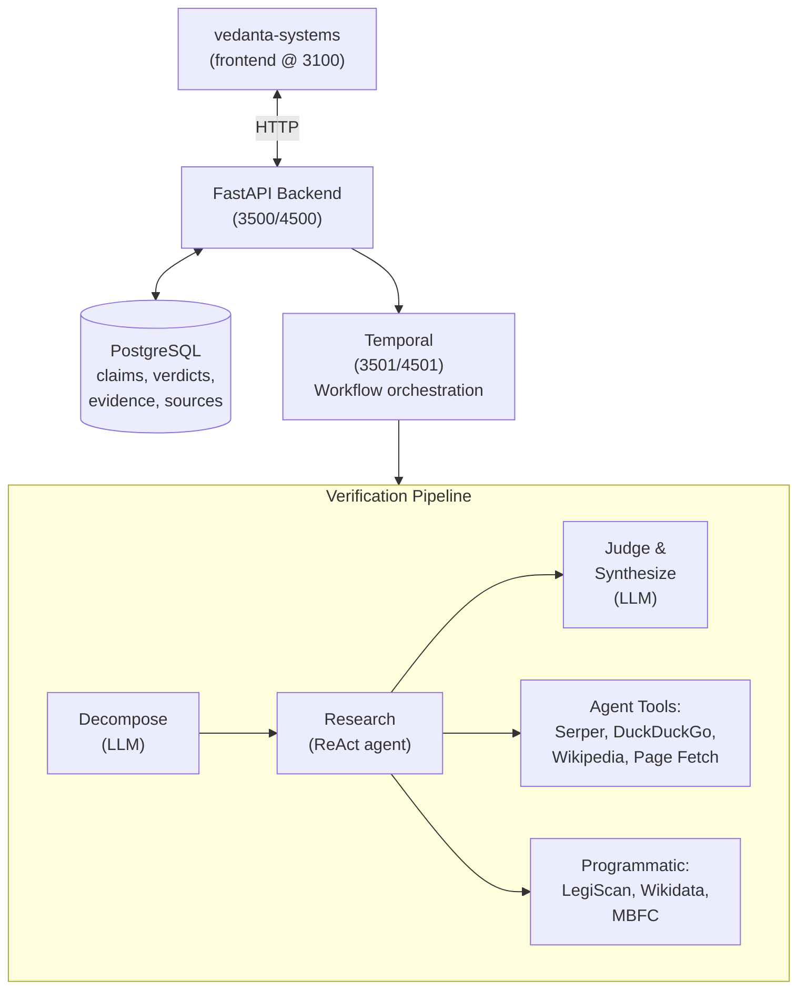
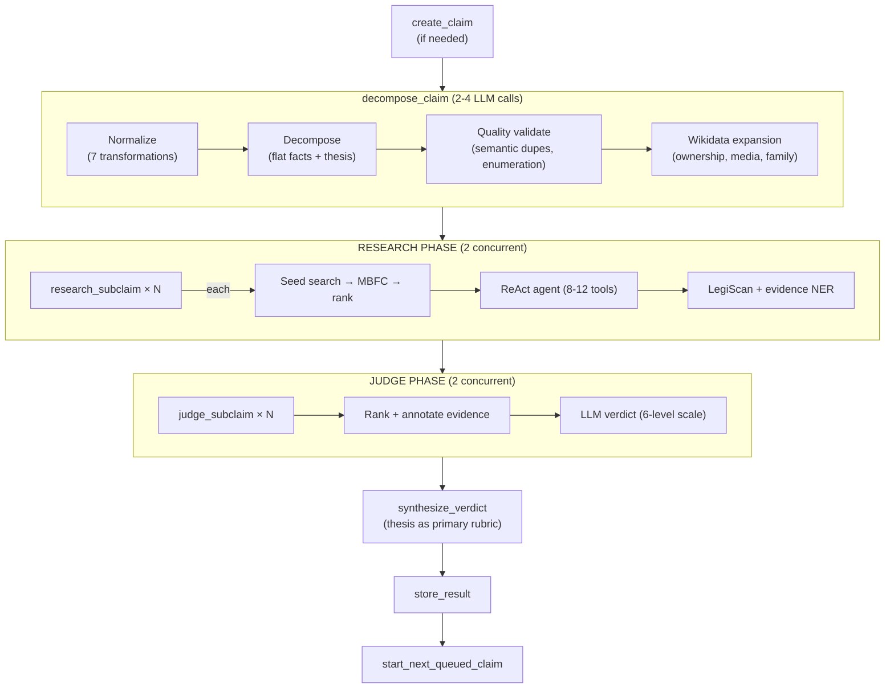

# Spin Cycle

News claim verification pipeline powered by LangGraph agents and local LLMs.

In a media landscape where misinformation spreads faster than corrections, Spin Cycle automatically ingests news claims, decomposes them into verifiable sub-claims, researches evidence from multiple sources, and delivers structured verdicts with full reasoning chains.

## Why "Spin Cycle"?

Because we're putting the spin through the wringer.

## Architecture



## Stack

| Component | Technology | Purpose |
|-----------|-----------|---------|
| Agent framework | [LangGraph](https://langchain-ai.github.io/langgraph/) | ReAct agent for autonomous evidence gathering |
| LLM toolkit | [LangChain](https://python.langchain.com/) | ChatOpenAI client, tool wrappers, message types |
| Workflow engine | [Temporal](https://temporal.io/) | Durable execution, retries, scheduling, visibility |
| LLM | Qwen3.5-122B-A10B (via llama.cpp/ROCm) | 122B MoE, 10B active, Q4_K_M |
| NER | [SpaCy](https://spacy.io/) (en_core_web_sm) | Entity extraction from claims and evidence (CPU, ~ms) |
| Knowledge graph | [Wikidata](https://www.wikidata.org/) SPARQL | Ownership chains, media holdings, family relationships |
| Source ratings | [MBFC](https://mediabiasfactcheck.com/) | Bias and factual reporting ratings (REST API index bootstrap + cached) |
| Legislation | [LegiScan](https://legiscan.com/) API | US bill search, roll call votes, bill text (Civic API tier) |
| Grammar | [LanguageTool](https://languagetool.org/) (Java, local) | Grammar correction on all LLM outputs (catches quantization artifacts) |
| Database | PostgreSQL 16 + SQLAlchemy 2.0 (async) | Claims, sub-claims, evidence, verdicts, source ratings |
| API | FastAPI | REST endpoints for claim submission and querying |

## How It Works

### 1. Claim Submission

```bash
curl -X POST http://localhost:4500/claims \
  -H "Content-Type: application/json" \
  -d '{"text": "Bitcoin was created by Satoshi Nakamoto in 2009"}'
```

### 2. Verification Pipeline (Temporal workflow)

The claim triggers `VerifyClaimWorkflow` — a flat pipeline of 7 activities:



Only one claim verifies at a time (to avoid LLM contention). When a claim finishes, the workflow starts the next queued one. Submitting while a claim is running queues it as a DB row.

The **flat facts** approach (matching Google SAFE and FActScore) means the LLM outputs facts directly as strings, guided by 15 extraction rules that catch presuppositions, quantifier scope, temporal boundaries, causation types, and more.

The thesis extraction ensures the synthesizer understands the **intent** of the claim, not just the individual facts. For example, a claim comparing two countries' policies is rated `mostly_false` even though 5/6 sub-facts are true — because one country's data contradicts the speaker's parallel comparison.

### 3. Result

```bash
curl http://localhost:4500/claims/{id}
```

```json
{
  "text": "Bitcoin was created by Satoshi Nakamoto in 2009 and the first block was mined on January 3rd",
  "status": "verified",
  "verdict": "true",
  "confidence": 0.95,
  "sub_claims": [
    {
      "text": "Bitcoin was created by Satoshi Nakamoto in 2009",
      "verdict": "true",
      "confidence": 0.95,
      "reasoning": "Multiple sources, including Wikipedia articles and news summaries, confirm that Bitcoin was created by Satoshi Nakamoto in 2009."
    },
    {
      "text": "The first block of Bitcoin was mined on January 3rd, 2009",
      "verdict": "true",
      "confidence": 0.95,
      "reasoning": "Multiple sources consistently state that the first Bitcoin block was mined on January 3, 2009."
    }
  ]
}
```

## Quick Start

### Prerequisites

- Docker and Docker Compose
- Access to an LLM server (any OpenAI-compatible endpoint, e.g. llama.cpp via Tailscale)
- (Optional) The `luv-dev` Docker network if running alongside vedanta-systems

### Setup

```bash
# Clone the repo
git clone git@github.com:vedantadhobley/spin-cycle.git
cd spin-cycle

# Create .env from template
cp .env.example .env
# Edit .env to set LLAMA_URL (your LLM endpoint)

# Create the external network (if it doesn't exist)
docker network create luv-dev 2>/dev/null || true

# Start the dev stack (7 containers)
docker compose -f docker-compose.dev.yml up -d

# Verify everything is running
docker compose -f docker-compose.dev.yml ps
```

### Services

| Service | URL | Description |
|---------|-----|-------------|
| API | http://localhost:4500 | FastAPI backend |
| Temporal UI | http://localhost:4501 | Workflow dashboard |
| Adminer | http://localhost:4502 | Postgres web UI (Dracula theme) |

Adminer login: Server `spin-cycle-dev-postgres`, User `spincycle`, Password `spin-cycle-dev`, Database `spincycle`.

### Testing Claims

There are three ways to submit claims and observe the pipeline.

#### Via curl (API)

```bash
# Submit a claim for verification
curl -s -X POST http://localhost:4500/claims \
  -H "Content-Type: application/json" \
  -d '{"text": "Bitcoin was created by Satoshi Nakamoto in 2009"}' | python3 -m json.tool

# Returns something like:
# { "id": "abc123...", "text": "...", "status": "pending", ... }

# Wait ~30 seconds for the pipeline to finish, then check the result
curl -s http://localhost:4500/claims/{id} | python3 -m json.tool

# List all claims (with pagination and optional status filter)
curl -s 'http://localhost:4500/claims?limit=10' | python3 -m json.tool
curl -s 'http://localhost:4500/claims?status=verified' | python3 -m json.tool

# Health check
curl -s http://localhost:4500/health
```

Submit multiple claims at once (first starts immediately, rest are queued):
```bash
curl -s -X POST http://localhost:4500/claims/batch \
  -H "Content-Type: application/json" \
  -d '{
    "claims": [
      {"text": "Claim one to verify", "source_name": "Source A"},
      {"text": "Claim two to verify"},
      {"text": "Claim three to verify"}
    ]
  }' | python3 -m json.tool
```

You can also submit a claim with full context (all fields optional except `text`):
```bash
curl -s -X POST http://localhost:4500/claims \
  -H "Content-Type: application/json" \
  -d '{
    "text": "Country A spent $50 billion on Project X before cancelling the second phase",
    "speaker": "Minister of Defense",
    "speaker_description": "Minister of Defense of Country B",
    "claim_date": "2026-03-15",
    "transcript_title": "Defense Committee Hearing",
    "source": "https://example.com/article",
    "source_name": "The Example Times"
  }' | python3 -m json.tool
```

#### Via Temporal UI

Open http://localhost:4501 and you can:

1. **Watch workflows execute** — click any workflow to see the full activity history (decompose → research → judge → synthesize → store), including inputs, outputs, and timings for each step.

2. **Start a workflow manually** — click "Start Workflow" in the top right:
   - Workflow Type: `VerifyClaimWorkflow`
   - Workflow ID: anything unique, e.g. `test-1`
   - Task Queue: `spin-cycle-verify`
   - Input: `[null, "The claim text", "Speaker Name", "2026-03-15", false, "Transcript Title", "Speaker's job title"]`

   Args: `[claim_id, text, speaker, claim_date, is_child, transcript_title, speaker_description]`. The first argument is `null` — the workflow will create the claim record automatically. Only `text` is required; others can be `null`.

3. **Replay and debug** — if a workflow fails, you can see exactly which activity failed, what it received, and what error it threw.

#### Via worker logs

Watch the verification pipeline in real-time:
```bash
# Follow worker logs (shows every step as it happens)
docker logs -f spin-cycle-dev-worker

# With LOG_FORMAT=pretty (default in dev), you'll see:
# I [WORKER    ] starting: Connecting to Temporal | temporal_host=... task_queue=spin-cycle-verify
# I [WORKER    ] ready: Worker listening | task_queue=spin-cycle-verify activity_count=7
# I [DECOMPOSE ] normalized: Claim normalized | changes=[...]
# I [DECOMPOSE ] quality_ok: Subclaim quality check passed
#   — or —
# I [DECOMPOSE ] quality_issues: Subclaim quality issues detected | issue_count=1 ...
# I [DECOMPOSE ] decompose_retry_success: Decompose retry succeeded | fact_count=1
# I [DECOMPOSE ] done: Claim decomposed | sub_count=3 thesis=...
# I [WORKFLOW  ] decomposed: Claim decomposed into atomic facts | fact_count=3
# I [RESEARCH  ] start: Starting research agent | sub_claim=...
# I [RESEARCH  ] done: Research complete | evidence_count=16
# I [JUDGE     ] done: Sub-claim judged | verdict=true confidence=0.95
# I [SYNTHESIZE] done: Verdict synthesized | verdict=mostly_true confidence=0.85
# I [STORE     ] done: Result stored in database | claim_id=... verdict=mostly_true

# With LOG_FORMAT=json (default in prod), output is JSON for Grafana Loki
```

## Environment Variables

| Variable | Default | Description |
|----------|---------|-------------|
| `LLAMA_URL` | (required) | LLM endpoint (Qwen3.5-122B-A10B via llama.cpp) |
| `LLAMA_EMBED_URL` | (optional) | Embeddings endpoint (not yet used) |
| `POSTGRES_PASSWORD` | `spin-cycle-dev` | Application Postgres password |
| `LOG_FORMAT` | `json` (prod) / `pretty` (dev) | Log output format — `json` for Grafana Loki, `pretty` for terminal |
| `LOG_LEVEL` | `INFO` | Log level — `DEBUG`, `INFO`, `WARNING`, `ERROR` |
| `SERPER_API_KEY` | (empty) | Serper key for Google search (primary search backend) |
| `LEGISCAN_API_KEY` | (empty) | LegiScan Civic API key (US legislation, votes, bill text) |

## Port Allocation

| Port | Dev | Prod | Service |
|------|-----|------|---------|
| Base | 4500 | 3500 | FastAPI API |
| +1 | 4501 | 3501 | Temporal UI |
| +2 | 4502 | 3502 | Adminer |

## Database

Nine tables in PostgreSQL, all with UUID primary keys (except cache tables which use string PKs):

| Table | Purpose | Key Columns |
|-------|---------|-------------|
| `claims` | Top-level claims | text, speaker, speaker_description, claim_date, transcript_title, status, decompose rubric (normalized_claim, thesis, key_test, claim_structure, claim_analysis) |
| `sub_claims` | Decomposed sub-claim tree | text, parent_id (self-ref FK), is_leaf, verdict, confidence, categories, seed_queries, judge_rubric (JSONB) |
| `evidence` | Research results per sub-claim | source_type, content, URL, bias, factual, tier, assessment, is_independent |
| `verdicts` | Overall claim verdict | verdict, confidence, reasoning, reasoning_chain (JSONB), synthesis_rubric (JSONB) |
| `interested_parties` | Entities with conflicts of interest | entity_name, role (direct/institutional/affiliated_media), source (llm/ner/wikidata) |
| `transcripts` | Stored transcript records | url, title, date, speakers, word_count, display_text, status |
| `transcript_claims` | Claims extracted from transcripts | claim_text, original_quote, speaker, worth_checking, skip_reason, checkable, is_restatement, segment_gist |
| `source_ratings` | Cached MBFC ratings | domain (PK), bias, factual_reporting, ownership, country |
| `wikidata_cache` | Cached Wikidata entity data | entity_name (PK), qid, relationships (JSONB), 7-day TTL |

Relationships: `claims` → has many `sub_claims` → has many `evidence`. `claims` → has one `verdict`. `claims` → has many `interested_parties`. `transcripts` → has many `transcript_claims` → optional FK to `claims`. Cache tables are standalone.

See [ARCHITECTURE.md](ARCHITECTURE.md) for full schema documentation with column types and constraints.

## Project Structure

```
spin-cycle/
├── docker-compose.dev.yml          # Dev stack (4500-4502)
├── docker-compose.yml              # Prod stack (3500-3502)
├── Dockerfile / Dockerfile.dev     # Container images
├── requirements.txt                # Python dependencies
├── .env.example                    # Environment template
│
├── src/
│   ├── worker.py                   # Temporal worker entrypoint
│   │
│   ├── llm/                        # LLM client layer
│   │   ├── client.py               # ChatOpenAI client setup
│   │   ├── invoker.py              # invoke_llm() — structured output + retries
│   │   ├── parser.py               # Response parsing helpers
│   │   └── validators.py           # Semantic validators (normalize, decompose, judge, synthesize, extraction)
│   │
│   ├── utils/                      # Shared utilities
│   │   ├── logging.py              # Structured logging (JSON for Loki, pretty for dev)
│   │   ├── ner.py                  # SpaCy NER — 3-pass entity extraction (PERSON/ORG)
│   │   ├── quote_detection.py      # Detect claim subject quotes in evidence text
│   │   ├── text_cleanup.py         # Grammar/spell check for LLM output
│   │   └── evidence_ranker.py      # Source + evidence quality scoring, seed ranking, judge capping
│   │
│   ├── api/                        # FastAPI backend
│   │   ├── app.py                  # App + lifespan (DB init + migration)
│   │   └── routes/
│   │       ├── health.py           # Health check
│   │       ├── claims.py           # Claim CRUD + batch submit
│   │       └── transcripts.py      # Transcript submission + query
│   │
│   ├── agent/                      # Domain logic (called by Temporal activities)
│   │   ├── decompose.py            # Normalize + extract facts + Wikidata expansion
│   │   ├── research.py             # Seed search + rank + ReAct agent + evidence extraction
│   │   ├── judge.py                # Evidence ranking, annotation, rubric-based LLM verdict
│   │   ├── synthesize.py           # Thesis-aware verdict synthesis with rubric
│   │   └── claim_category.py       # Seed query routing (backend selection)
│   │
│   ├── tools/                      # Evidence gathering + data sources
│   │   ├── source_ratings.py       # MBFC ratings (scrape + cache + parallel await)
│   │   ├── source_filter.py        # Domain blocklist + MBFC cache population
│   │   ├── mbfc_index.py           # MBFC REST API index bootstrap (~10,300 sources)
│   │   ├── media_matching.py       # URL↔media matching, publisher ownership
│   │   ├── wikidata.py             # Wikidata SPARQL — ownership chains, relationships
│   │   ├── legiscan.py             # LegiScan API — US legislation, votes, bill text
│   │   ├── serper.py               # Serper (Google Search API) — primary search backend
│   │   ├── brave.py                # Brave Search API
│   │   ├── web_search.py           # DuckDuckGo (fallback search backend)
│   │   ├── wikipedia.py            # Wikipedia API
│   │   └── page_fetcher.py         # URL → text extraction + SpaCy entity metadata
│   │
│   ├── prompts/                    # LLM prompts (heavily documented)
│   │   ├── verification.py         # Normalize, Decompose, Research, Judge, Synthesize
│   │   └── extraction.py           # Transcript claim extraction
│   │
│   ├── schemas/                    # Data schemas
│   │   ├── api.py                  # Pydantic API request/response models
│   │   ├── llm_outputs.py          # Pydantic schemas for LLM structured output (rubric-based)
│   │   └── interested_parties.py   # InterestedPartiesDict TypedDict (pipeline contract)
│   │
│   ├── workflows/
│   │   ├── verify.py               # VerifyClaimWorkflow (7 activities)
│   │   └── extract_transcript.py   # ExtractTranscriptWorkflow (8 activities)
│   │
│   ├── activities/
│   │   ├── verify_activities.py    # Verification activities (decompose, research, judge, synthesize, store)
│   │   └── transcript_activities.py # Transcript activities (fetch, extract, finalize, store)
│   │
│   ├── transcript/                 # Transcript processing
│   │   ├── fetcher.py              # Rev.com transcript fetcher + parser
│   │   └── extractor.py            # Segment-batched claim extraction (programmatic filtering)
│   │
│   └── db/
│       ├── models.py               # SQLAlchemy models (9 tables)
│       └── session.py              # Async DB sessions
│
└── tests/
    ├── test_health.py
    ├── test_schemas.py
    ├── test_evidence_ranker.py
    ├── regression_claims.py         # Known-answer regression suite
    └── stress_claims.py             # Load/stress testing
```

## Observability

Grafana dashboard at `~/workspace/monitor/grafana/provisioning/dashboards/spin-cycle.json` provides:
- Pipeline status KPIs (claims verified, errors, LLM latency)
- Verdict distribution and confidence trends
- Per-stage completion rates (decompose, research, judge, synthesize)
- Evidence quality metrics (direction distribution, independence)
- Transcript extraction pipeline metrics
- Error/warning breakdown by module
- Live log panels (errors + all logs)

Data flows via structured JSON logs → Promtail → Loki → Grafana.

## What's Next

1. **Alembic migrations** — proper database schema versioning (currently using `_migrate()` with raw SQL ALTER TABLE)
2. **Calibration test suite** — benchmark against known claims to measure accuracy
3. **LangFuse** — self-hosted LLM observability for prompt debugging

See [ARCHITECTURE.md](ARCHITECTURE.md) for the full technical deep dive.
