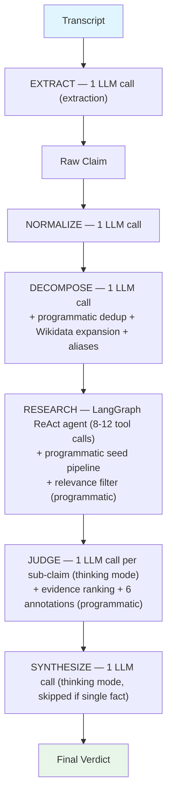
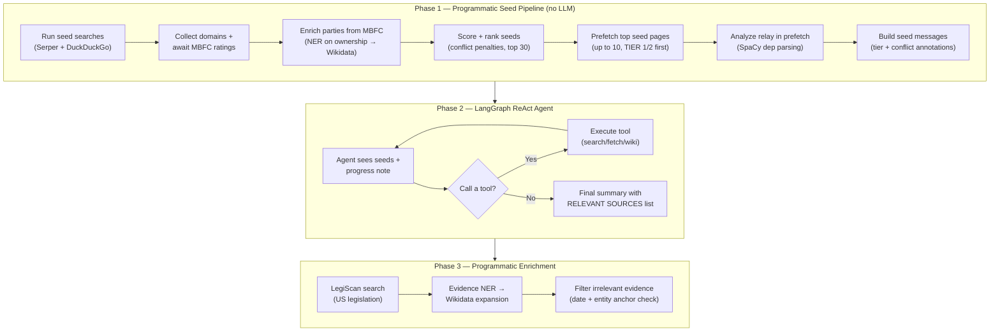

# LLM Calls Reference

Every LLM invocation in the verification pipeline, with prompt locations,
structured output schemas, forcing fields, validation, and scoring/ranking
behavior. Updated 2026-03-25 (calibration rules restoration, relay detection, Wikidata aliases, designation loophole, 6 judge checks, thinking mode tested and reverted).

---

## Pipeline Overview



**Model**: Qwen3.5-122B-A10B (122B params, 10B active MoE, Q4_K_M)
via llama.cpp ROCm on AMD Strix Halo (125GB unified memory).
Server: `--parallel 2 --ctx-size 131072` (2 slots x 65K context each, ~3 GB KV cache thanks to hybrid architecture: 2 KV heads, 12 attention layers of 48 total — rest are recurrent/SSM). Embedding model (3103) disabled via Docker profiles.

**All steps use instruct mode** (`enable_thinking=False`, temp=0.0, max_tokens=8192-16384). Thinking mode was tested for judge/synthesize and reverted due to 5-10x latency, schema validation failures, and silent activity crashes — the prompt's calibration rules achieve the same reasoning quality. See ARCHITECTURE.md § Thinking Mode Experiment.

---

## Call 1: Extract Claims from Transcript

**When**: Processing a transcript (not used for direct claim submissions).

**Files**:
- Prompts: `src/prompts/extraction.py` — `EXTRACTION_SYSTEM` (L18), `EXTRACTION_USER` (L93)
- Invoker: `src/transcript/extractor.py`
- Schema: `src/transcript/extractor.py` — `ExtractionOutput` (L70), `SegmentExtraction` (L63), `ExtractedClaim` (L50)
- Validator: `src/llm/validators.py` — `validate_extraction()`

**Temperature**: 0.0 initial, 0.3 on retry. **Retries**: 1 (only if <50% segment coverage).

**Placeholders**: `{current_date}`, `{transcript_text}`, `{segment_manifest}`, `{context_note}`

### What it does

Processes transcript segments, identifying every factual assertion. For each,
assesses checkability (could independent data confirm/deny this?) and resolves
pronouns/ambiguous references via square bracket insertion. No editorial
judgment at extraction time — filtering is entirely programmatic.

### Structured output

```
ExtractionOutput
  segments: list[SegmentExtraction]
    speaker: str
    segment_gist: str          ← FORCING: 1-sentence segment purpose
    assertion_count: int       ← FORCING: count before listing
    claims: list[ExtractedClaim]
      claim_text: str          ← decontextualized — pronouns resolved, stands alone
      original_quote: str      ← speaker's exact words
      speaker: str             ← propagated from segment level
      checkable: bool
      checkability_rationale: str
      is_restatement: bool
      worth_checking: bool     ← computed: checkable AND NOT restatement
      skip_reason: str?        ← set programmatically if not worth checking
```

Fields computed programmatically (not in LLM output):
- `worth_checking: bool` — checkable AND NOT is_restatement AND NOT future_prediction
- `skip_reason: str?` — "not_checkable", "restatement", or "future_prediction"

### Key rules

- **5-step process**: segment_gist → identify assertions → checkability →
  bracket insertion → restatement detection
- **Bracket insertion**: Resolve pronouns (he/she/they/their/it/we/our/I),
  ambiguous noun phrases ("the company", "the bill"). Do NOT bracket
  temporal references or already-explicit terms.
- **Bracket examples**: "Their naval building was destroyed" → "[Iran's]
  naval building was destroyed". "We will defend our allies" →
  "[The United States] will defend [its] allies"
- **worth_checking**: Computed programmatically — `checkable AND NOT
  is_restatement AND NOT future_prediction`. No editorial judgment.
- **Future predictions**: Regex-detected post-LLM → forced to
  checkable=False, worth_checking=False

### Post-LLM enforcement

- Future prediction regex → checkable=False, worth_checking=False, skip_reason="future_prediction"
- is_restatement → worth_checking=False, skip_reason="restatement"
- not checkable → worth_checking=False, skip_reason="not_checkable"

---

## Call 2: Normalize Claim

**When**: First step of verification for every claim.

**Files**:
- Prompts: `src/prompts/verification.py` — `NORMALIZE_SYSTEM` (L422), `NORMALIZE_USER` (L484)
- Invoker: `src/agent/decompose.py`
- Schema: `src/schemas/llm_outputs.py` — `NormalizeOutput`
- Validator: `src/llm/validators.py` — `validate_normalize()`

**Temperature**: 0.0. **Retries**: 1.

**Placeholders**: `{current_date}`, `{claim_date_line}`, `{speaker_line}`, `{claim_text}`

### What it does

Rewrites claim in neutral, researchable language via 7 transformations:
1. Bias neutralization (loaded language → neutral equivalents)
2. Operationalization (vague concepts → measurable)
3. Normative/factual separation (strip opinions, keep facts)
4. Coreference resolution (pronouns → specific names)
5. Reference grounding (acronyms → expansions)
6. Speculative language handling (flag predictions)
7. Rhetorical/sarcastic framing (convert to literal assertions)

### Structured output

```
NormalizeOutput
  normalized_claim: str    ← rewritten claim
  changes: list[str]       ← ["what was changed and why", ...]
```

### Key rules

- Preserve original meaning — do NOT weaken characterizations that
  independent bodies assess (proportional, fair, effective)
- Anti-weakening: if an institution evaluates a characterization,
  keep it for the pipeline to verify
- Classifications/designations are labels from an authority —
  operationalize to the underlying factual claim
- Flag pragmatically misleading claims (literal meaning ≠ natural reading)
- Flag intent language ("aims to", "intends to") as usually unverifiable
- Do NOT add information not in the original claim
- `normalized_claim` ≤5000 chars (prevents elaboration)

---

## Call 3: Decompose into Atomic Facts

**When**: After normalization, for every claim.

**Files**:
- Prompts: `src/prompts/verification.py` — `DECOMPOSE_SYSTEM` (L497), `DECOMPOSE_USER` (L694)
- Invoker: `src/agent/decompose.py:448`
- Schema: `src/schemas/llm_outputs.py` — `DecomposeOutput`
- Validator: `src/llm/validators.py` — `validate_decompose()`

**Temperature**: 0.0. **Retries**: 2.

**Placeholders**: `{current_date}`, `{claim_date_line}`, `{speaker_line}`, `{claim_text}`

### What it does

4-step structured decomposition:
1. **Analyze claim** — what is it asserting? (`claim_analysis`)
2. **Classify structure** — simple, parallel, causal, ranking, temporal, etc.
3. **Identify thesis + key test** — what must be true for the claim to hold?
4. **Map interested parties** — direct subjects, institutional, affiliated media
5. **Extract atomic facts** — each with verification_target, categories, seed_queries

### Structured output

```
DecomposeOutput
  claim_analysis: str           ← FORCING: what is claim asserting?
  structure: str                ← simple|parallel_comparison|causal|ranking|temporal_sequence|...
  structure_justification: str  ← FORCING: why this structure?
  thesis: str                   ← FORCING: what is speaker arguing?
  key_test: str                 ← FORCING: what must ALL be true?
  interested_parties: InterestedPartiesDict
    direct: list[str]
    institutional: list[str]
    affiliated_media: list[str]
    reasoning: str
  facts: list[AtomicFact]
    text: str                   ← standalone, decontextualized fact
    verification_target: str    ← "Is [specific thing] true?"
    categories: list[str]       ← QUANTITATIVE|LEGISLATIVE|SCIENTIFIC|CAUSAL|...
    category_rationale: str
    seed_queries: list[str]     ← 2-4 search queries for evidence
```

### 15 extraction rules

1. Expand parallel structures ("Both X and Y do Z" → 2 facts)
2. Preserve exact quantities and values
3. Extract hidden presuppositions (only for trigger words: stopped, again, resumed, etc.)
4. Falsifying conditions (only for superlatives: only, first, never, always)
5. Make exclusions/contrasts explicit ("other countries" → "countries other than X")
6. **Decontextualize each fact** — standalone, with specific names.
   Military examples: "Nine ships destroyed" → "Nine [Country X] naval ships destroyed in [Operation Name]".
   **Check for unresolved pronouns**: their, his, her, its, they, them, the attack, the operation — if any remain, not decontextualized.
7. Extract underlying factual question (loaded → neutral). NO ATTRIBUTION HEDGING.
8. Entity disambiguation (add minimum context to uniquely identify)
9. Operationalize comparisons (define comparison group by shared trait)
10. Searchability test (every fact must be a natural-language sentence a researcher could search for — no placeholders, brackets, algebraic variables)
11. Trend/series claims → 1 fact about the trend, NOT N year comparisons
12. Group quantifier claims → 1 fact about the group, NOT N member checks
13. Polarity preservation (don't flip negative to positive)
14. No injection of "overwhelming" or modifiers not in original
15. Verification target must ask whether something IS true, not whether someone SAID it

### Post-LLM pipeline (decompose.py)

1. Programmatic dedup (trivial: punctuation, case, whitespace)
2. NER Pass 1: extract PERSON/ORG from claim text
3. Add speaker as direct interested party
4. Wikidata expansion: `get_ownership_chain()` → executives, family, media holdings, affiliated orgs
5. Wikidata aliases: `get_entity_aliases()` fetches entity aliases (e.g., "Trump" for "Donald Trump"). Passed through pipeline as `party_aliases` in InterestedPartiesDict

### Speaker description pre-resolution

If `speaker_description` is provided (from transcript extraction's Wikidata lookup),
decompose skips its own Wikidata speaker lookup. Standalone claims without a
pre-resolved description fall back to looking up the speaker in Wikidata during decompose.

---

## Post-Decompose Quality Check (Programmatic Only)

**When**: After decompose, only if ≥2 facts.

**Files**:
- Logic: `src/agent/decompose.py` — `_validate_subclaim_quality()` (L337)

### What it does

Programmatic near-duplicate removal only (punctuation, case, whitespace
differences). The LLM semantic duplicate check was removed due to a 100%
false positive rate that collapsed valid decompositions (e.g., "greatest"
+ "most powerful" → just "most powerful"). Issues list is always empty —
no LLM retry is triggered from this step.

---

## Research Phase: LangGraph ReAct Agent

**When**: For each atomic fact from decompose.

**Files**:
- Prompts: `src/prompts/verification.py` — `RESEARCH_SYSTEM` (L710), `RESEARCH_USER` (L799)
- Agent builder: `src/agent/research.py` — `build_research_agent()` (L352)
- Entry point: `src/agent/research.py` — `research_claim()` (L1395)

**Temperature**: 0. **Max steps**: 47 (~15 tool calls). **Timeout**: 420s.

**Placeholders**: `{current_date}`, `{claim_date_line}`, `{speaker_line}`, `{sub_claim}`

### Architecture



**Phase 1 — Programmatic seed pipeline** (no LLM, ~3-20s):
1. `_run_seed_searches()`: Fire LLM-written queries + base queries to Serper/DuckDuckGo
2. `_collect_domains()` + `await_ratings_parallel()`: Warm MBFC cache
3. `_enrich_parties_from_mbfc()`: NER on MBFC ownership → Wikidata expansion
4. `_rank_and_filter_seeds()`: `score_url()` each seed, detect interested-party conflicts (affiliated media + publisher ownership), apply CONFLICT_PENALTY (-15), sort, keep top 30. Each seed annotated with `_tier` (display label), `_source_tier` (int), and `_conflict_flags`.
5. `_prefetch_seed_pages()`: Fetch full content from top seeds (up to 10, TIER 1/2 first via `_source_tier`)
6. `_analyze_relay_in_prefetch()`: SpaCy dependency parsing on prefetched evidence to detect authority relays (evidence that derives from an interested party's own determination/designation/document). If >60% of prefetched evidence is relay-based, injects "SEARCH DIFFERENTLY" guidance into the agent prompt
7. `_build_seed_messages()`: Package as synthetic AIMessage+ToolMessage pairs. Each seed annotated with `Source tier: {tier_label}` line and `Conflict: {flags}` line (if any) so the agent sees source quality inline.

**Phase 2 — LangGraph ReAct agent** (~60-120s):
Agent starts with seed results in history, spends budget on follow-up searches and fetches.
Must list `RELEVANT SOURCES:` in final summary — URLs it considers on-topic.
Evidence items are tagged with `agent_relevant=True/False` based on this list.

Stopping criteria:
- Both directions with 2+ independent sources each, OR
- 8 searches + 2 counter-searches with one-direction evidence, OR
- 7 searches with nothing relevant found

**Phase 3 — Programmatic enrichment**:
- `_enrich_with_legislation()`: LegiScan search for matching bills/votes
- `_enrich_parties_from_evidence_content()`: NER on evidence → Wikidata expansion
- `_filter_irrelevant_evidence()`: Date + entity anchor relevance filter

### Agent tools

- `serper_search()` — primary search engine
- `duckduckgo_search()` — fallback
- `fetch_page_content()` — read full articles
- `wikipedia_search()` — Wikipedia API

### Key rules in system prompt

- Search both directions (supporting AND contradicting evidence)
- For comparative claims, search each side independently
- Source tiers: primary documents > independent reporting > government statements
- **Government sources are interested parties** — not independent
- **Interested-party statements are claims, not evidence**: a politician
  denying something doesn't make it false; a press office asserting
  something doesn't make it true; government websites describing own
  policies are advocacy — find the actual legislation, data, or treaty text
- Never cite: Reddit, forums, social media, YouTube, personal blogs, content farms, or third-party fact-check sites (Snopes, PolitiFact)
- When reputable sources conflict, gather BOTH
- Prefer recent sources for current claims

### Evidence quality pipeline (programmatic, post-agent)

**Agent relevance tagging** (`extract_evidence()` in `research.py`):
Agent lists `RELEVANT SOURCES:` URLs in its final summary. Evidence items
matching those URLs get `agent_relevant=True`; others get `agent_relevant=False`.
Used in `score_evidence()` as +15 (relevant) / -20 (not listed) scoring modifier.

**Irrelevance filter** (`_filter_irrelevant_evidence()` in `research.py`):
Two checks, **both must fail** for an item to be dropped:

1. **Date check**: If claim_date available, extract claim_year. If evidence's
   most prominent year is >5 years from claim_year AND claim_year doesn't
   appear in evidence → flag.
2. **Entity anchor check**: Build anchor set from interested parties + NER
   on claim_text + speaker. If evidence mentions zero anchors → flag.

Example: A Pearl Harbor (1941) article about US Navy with no mention of Iran
fails both checks when researching a 2026 Iran claim → dropped.

---

## Call 5: Judge Evidence (per sub-claim)

**When**: For each sub-claim after research completes.

**Files**:
- Prompts: `src/prompts/verification.py` — `JUDGE_SYSTEM` (L848), `JUDGE_USER` (L1038)
- Invoker: `src/agent/judge.py:159`
- Schema: `src/schemas/llm_outputs.py` — `JudgeOutput`
- Validator: `src/llm/validators.py` — `validate_judge()` (L133)

**Mode**: Instruct (`enable_thinking=False`, temp=0, max_tokens=16384). **Retries**: 2. **Activity timeout**: 300s.

**Placeholders**: `{current_date}`, `{claim_date_line}`, `{speaker_line}`, `{transcript_context}`, `{claim_text}`, `{sub_claim}`, `{verification_line}`, `{key_test_line}`, `{evidence_text}`

### What it does

5-step rubric evaluation:
1. **Interpret claim** — charitable restatement, handle absolute language. If a key test is provided (from decompose), evaluation must address whether evidence satisfies or undermines that test.
2. **Triage key evidence** — assess 3-5 sources for independence.
   Outlet reliability ≠ claim reliability (PBS reporting "X says Y" is
   reliable reporting, not verification of Y). Qualified language in
   sources ("one of the largest" vs "the largest") is precision evidence.
3. **Assess direction** — (independent evidence only) supports/contradicts/mixed
4. **Assess precision** — claim specificity vs evidence completeness
5. **Render verdict** — true|mostly_true|mixed|mostly_false|false|unverifiable.
   Contested classifications: expert consensus ≠ settled fact without
   a binding legal/institutional determination (cap at mostly_true).
   **Designation loophole**: when the "binding determination" comes from an
   interested party, it IS the claim, not independent confirmation. Volume
   of sources reporting a designation ≠ independent verification.

### Structured output

```
JudgeOutput
  claim_interpretation: str       ← FORCING: charitable restatement
  key_evidence: list[EvidenceAssessment]
    source_index: int             ← 1-indexed into evidence list
    assessment: str               ← supports|contradicts|mixed|neutral
    is_independent: bool          ← FORCING: from interested parties?
    key_point: str                ← 1-2 sentence finding
  evidence_direction: str         ← FORCING: clearly_supports|leans_supports|genuinely_mixed|leans_contradicts|clearly_contradicts|insufficient
  direction_reasoning: str        ← FORCING: 2-3 sentences
  precision_assessment: str       ← FORCING: specificity analysis
  verdict: str                    ← FORCING: one of 6 values
  confidence: float               ← 0.0-1.0
  reasoning: str                  ← public-facing with [N] citations
```

### Key test passthrough

The `key_test` from decompose (what must be true for the overall claim to hold) is injected
into the judge user prompt via `{key_test_line}`. This anchors subclaim evaluation to the
overall claim's success criteria. Critical for single-fact claims that skip synthesis entirely.

### Evidence annotation (judge.py `_annotate_evidence()`, pre-LLM)

Before the LLM call, each evidence item is annotated with 6 checks:
- **Check 0 — Government source warning**: All `.gov`/`.mil` domains get `⚠️ GOVERNMENT SOURCE`
- **Check 1 — Affiliated media**: Source URL matches media owned by interested party → `⚠️ AFFILIATED MEDIA`
- **Check 2 — Quoted interested party**: Proximity-window attribution matching detects when evidence quotes claim subjects → `⚠️ QUOTES INTERESTED PARTY`. Uses three-layer name matching: exact party name, programmatic last-name variants, Wikidata aliases (via `party_aliases` parameter)
- **Check 3 — Publisher ownership**: Publisher owned by interested party (via MBFC ownership) → `⚠️ PUBLISHER OWNS/IS OWNED BY`
- **Check 4 — Sub-source MBFC**: Evidence references another publication with poor factual rating → sub-source warning
- **Check 5 — Authority relay**: SpaCy dependency parsing detects when evidence derives from an interested party's own determination/designation/document → `⚠️ AUTHORITY RELAY`. Three layers: authority-agent, document-attribution, reaffirmation

Plus metadata:
- **Source tag**: `[Center (-0.5) | Very High factual | UK Wire Service]` or
  `[USA Government | FBI]` (from MBFC data via `_format_source_tag()`)
- **Tier label**: from `evidence_ranker.tier_label()` — e.g., "TIER 1 (very high factual)", "TIER 2 (high factual)", "government" (no tier for unrated gov)
- **Quality summary**: tier distribution, bias spread, domain count

### Unrated source filtering

Evidence items with no MBFC rating (tier 0 / unrated) are dropped before the judge sees them.
This prevents low-quality unknown sources from diluting the evidence pool.

### Scoring, tiering, and ranking (evidence_ranker.py)

Three separate systems handle source quality. They exist because each
serves a different purpose — fine ranking, coarse code decisions, and
LLM-facing display — and conflating them would create either brittle
string parsing or insufficient granularity.

#### System 1: Numeric Score (`score_url` / `score_evidence` / `rank_and_select`)

Fine-grained composite score (0-100) used to **sort and select** evidence.
Not shown to LLMs.

**Components** (max ~100 per item):
- MBFC factual reporting (0-30): very-high=30, high=24, mostly-factual=16, mixed=8, low=4, very-low=2, unrated=4
- Source type (0-30): wikipedia=30, legiscan=28, news_api=15, web=10
- Content richness (0-30): >2000 chars=30, >800=20, >200=10
- MBFC credibility (0-10): high=10, medium=5, low=2, unrated=2
- **Gov/edu TLD (0-10)**: .edu=10, **.gov/.mil=0** (no bonus — must earn rank via MBFC)

`score_url()` uses only factual + gov_tld + credibility (max 40). Used
in seed ranking (research.py) where content length is unknown.

`score_evidence()` adds source_type + content_richness (max ~100). Used
in judge evidence capping (judge.py) where full content is available.

**Used in two places**:
1. **Seed ranking** (`_rank_and_filter_seeds()` in research.py): `score_url()` scores ~80 seeds, conflict penalty applied (-15 for affiliated/owned sources), sorted, top 30 kept.
2. **Judge evidence capping** (`rank_and_select()` in judge.py): `score_evidence()` scores ~50 evidence items, sorted, top 20 kept after caps.

**Gov source scoring examples**:
- Gov without MBFC: score 6 (factual=4 + credibility=2). Same as unknown domains — no TLD bonus.
- Gov with MBFC high: score 34 (factual=24 + credibility=10). Competitive but not inflated.

#### System 2: Programmatic Tier (`source_tier` -> int)

Coarse bucket (0/1/2/3) for **Python logic decisions**. Not shown to LLMs.

- `1`: MBFC very-high factual, academic (.edu), gov with very-high MBFC
- `2`: MBFC high or mostly-factual, gov with high/mostly-factual MBFC, Wikipedia
- `3`: Government/military without qualifying MBFC rating
- `0`: Unknown/unrated

**Used for**: prefetch priority selection (tier 1/2 seeds get pre-fetched
first, filling up to 10 slots before untiered seeds), progress counter
display.

#### System 3: Display Tier Label (`tier_label` -> str)

Human-readable string shown to LLMs in seed annotations and judge
quality summaries. Influences judge reasoning about source quality.

- `TIER 1 (very high factual)` — MBFC very-high (non-gov)
- `TIER 1 (government, very high factual)` — .gov with MBFC very-high
- `TIER 1 (academic)` — .edu domains
- `TIER 2 (high factual)` — MBFC high (non-gov)
- `TIER 2 (mostly factual)` — MBFC mostly-factual (non-gov)
- `TIER 2 (government, high factual)` — .gov with MBFC high
- `TIER 2 (government, mostly factual)` — .gov with MBFC mostly-factual
- `government` — .gov/.mil without qualifying MBFC rating (NO tier number)
- empty string — unknown/low-quality

**Never parsed by Python code for logic** — display only. All programmatic
decisions use `source_tier()` (System 2) instead.

#### Why all three exist

- **Numeric score**: Fine granularity for ranking. Breaks ties between similar sources (e.g., a high-factual outlet with rich content vs one with a thin snippet).
- **Programmatic tier**: Coarse bucket for code decisions. Avoids string-parsing display labels for logic (fragile, breaks on label wording changes).
- **Display label**: Tells the LLM what quality tier a source is. The judge uses this when assessing evidence independence and weighting.

#### `rank_and_select` caps (applied in order)

1. **Content floor**: items <80 chars dropped (hub pages, failed fetches)
2. **Domain cap**: max 3 per domain (default), **max 5 per domain for TIER 1** sources (via `max_per_domain_tier1` parameter — wire services like Reuters/AP often have multiple high-quality articles)
3. **Gov/mil category cap**: max 4 gov/mil items total. Excess removed (lowest-scoring first), backfilled with non-gov items from overflow.
4. **Overall cap**: max 20 items

#### Gov source philosophy

Government sources are identified (the judge sees "government" and
`[USA Government | FBI]` tags) but receive **zero scoring advantage**
from their TLD (`GOV_TLD_SCORE=0`). They must earn tier placement via
MBFC rating like any other source. An unrated `.gov` scores 6, the same
as an unknown domain. Max 4 gov items per 20 evidence slots.

### Rhetorical trap detection (9 patterns with detection heuristics)

Each trap now includes a 1-line detection pattern in the prompt to trigger
model recognition (not just the trap name):

1. Cherry-picking — unrepresentative data point or selective timeframe
2. Correlation ≠ causation — coincidence without mechanism evidence
3. Definition games — truth depends on which definition is used
4. Time-sensitivity — true then ≠ true now; stale evidence; old facts framed as current
5. Survivorship bias — multiple sources sharing one origin ≠ independent
6. Statistical framing — relative vs absolute numbers distorting scale
7. Anecdotal vs systematic — one case ≠ pattern
8. False balance — one dissenter ≠ ten corroborating
9. Retroactive status — current title ≠ role held at event time

### Legal/regulatory section

Framing principle added: legality ≠ legitimacy (verdict addresses factual
accuracy, not policy judgment). Flags: selective enforcement, regulatory
capture, letter vs spirit, precedent inconsistency.

### Semantic validation (validators.py)

8 checks in `validate_judge()`:
1. `claim_interpretation` not empty
2. `key_evidence` not empty
3. `direction_reasoning` ≥10 chars
4. `precision_assessment` ≥10 chars
5. `reasoning` ≥10 chars
6. **Citation enforcement (hard)**: If verdict ≠ "unverifiable", require `min(3, len(key_evidence))` unique [N] citations in reasoning. Failures trigger LLM retry. (`MIN_JUDGE_CITATIONS=3`)
7. Warning (log, no reject): low confidence (<0.3) on strong verdict
8. Warning (log, no reject): high confidence (>0.8) on "unverifiable"

### Consistency check (permissive, log-only)

- Direction says supports but verdict says false → warning
- Direction says contradicts but verdict says true → warning
- No independent evidence but strong (true/false) verdict → warning

---

## Call 6: Synthesize Final Verdict

**When**: Only if decompose produced >1 fact. Skipped for single-fact claims.

**Files**:
- Prompts: `src/prompts/verification.py` — `SYNTHESIZE_SYSTEM` (L1059), `SYNTHESIZE_USER` (L1155)
- Invoker: `src/agent/synthesize.py:20`
- Schema: `src/schemas/llm_outputs.py` — `SynthesizeOutput`
- Validator: `src/llm/validators.py` — `validate_synthesize()` (L182)

**Mode**: Instruct (`enable_thinking=False`, temp=0, max_tokens=16384). **Retries**: 2. **Activity timeout**: 300s.

**Placeholders**: `{current_date}`, `{claim_date_line}`, `{transcript_context}`, `{synthesis_framing}`, `{sub_verdicts_text}`, `{evidence_digest}`

### What it does

4-step rubric combining sub-verdicts:
1. **Identify thesis** — what is speaker fundamentally arguing?
2. **Classify each sub-claim** — core_assertion | supporting_detail | background_context
3. **Does thesis survive?** — based on CORE assertion verdicts only
4. **Render verdict** — weighted by importance, not count.
   **Designation loophole**: when the "binding determination" comes from an
   interested party, it IS the claim, not independent confirmation. Volume
   of sources reporting a designation ≠ independent verification.

### Structured output

```
SynthesizeOutput
  thesis_restatement: str           ← FORCING: 1 sentence
  subclaim_weights: list[SubclaimWeight]
    subclaim_index: int
    role: str                       ← core_assertion|supporting_detail|background_context
    brief_reason: str               ← why this classification
  thesis_survives: bool             ← FORCING: does thesis hold?
  verdict: str                      ← FORCING: one of 6 values
  confidence: float                 ← 0.0-1.0
  reasoning: str                    ← public-facing, never references sub-claim numbers
```

### Key rules

- Weight by importance, not count. Wrong supporting details don't flip true core assertions.
- Trust sub-claim verdicts — don't re-judge evidence
- Correlated evidence: if multiple sub-verdicts rely on the same source, note it
- Unverifiable elements: if some facts are unverifiable but core facts are judged, still render a verdict on the verifiable parts
- Reasoning must never reference internal process (sub-claim numbers, rubric steps)

### Citation enforcement (hard validation)

If verdict ≠ "unverifiable", reasoning must contain at least 5 unique [N] citations from the
evidence digest. Failures trigger LLM retry. (`MIN_SYNTHESIZE_CITATIONS=5`)

### Evidence digest (synthesize.py)

Built from judge-cited sources only (sources referenced in [N] notation).
Typically 10-20 unique items after deduplication across sub-claims.

### Consistency check (permissive, log-only)

- thesis_survives=True but verdict=mostly_false/false → warning
- thesis_survives=False but verdict=true/mostly_true → warning

---

## Summary Table

| # | Stage | Prompt Constants | Mode | Schema | Validator |
|---|-------|-----------------|------|--------|-----------|
| 1 | Extract | EXTRACTION_SYSTEM + _USER | instruct (0→0.3) | ExtractionOutput | validate_extraction |
| 2 | Normalize | NORMALIZE_SYSTEM + _USER | instruct (0) | NormalizeOutput | validate_normalize |
| 3 | Decompose | DECOMPOSE_SYSTEM + _USER | instruct (0→0.1) | DecomposeOutput | validate_decompose |
| — | Quality Check | (programmatic only — no LLM call) | — | — | — |
| — | Research | RESEARCH_SYSTEM + _USER | instruct (0) | (none — agent) | — |
| 5 | Judge | JUDGE_SYSTEM + _USER | instruct (0) | JudgeOutput | validate_judge |
| 6 | Synthesize | SYNTHESIZE_SYSTEM + _USER | instruct (0) | SynthesizeOutput | validate_synthesize |

All prompts live in `src/prompts/verification.py` (verification pipeline) and `src/prompts/extraction.py` (transcript extraction).
