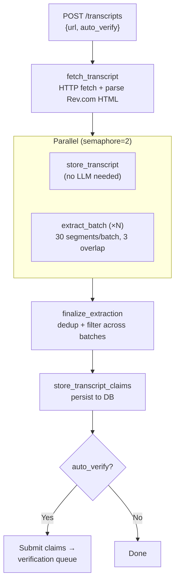

# Transcript Pipeline — Project Plan

## Overview

Spin Cycle's transcript pipeline extracts verifiable claims from political
transcripts (Rev.com), verifies them through the existing fact-checking pipeline,
and presents the results in a frontend where users can explore both the full
transcript text and individual claims.

## Database Schema

### Tables

```
transcripts
├── id            UUID PK
├── url           VARCHAR(2048) UNIQUE  — Rev.com URL
├── title         VARCHAR(512)
├── date          VARCHAR(64)           — ISO date if available
├── speakers      JSONB                 — ["Speaker A", "Speaker B"]
├── word_count    INTEGER
├── segment_count INTEGER
├── display_text  TEXT                  — cleaned, merged same-speaker text
├── status        VARCHAR(32)           — queued → extracting → verifying → complete
└── created_at    TIMESTAMPTZ

transcript_claims
├── id                      UUID PK
├── transcript_id           FK → transcripts.id
├── claim_id                FK → claims.id (nullable — set when sent to verification)
├── claim_text              TEXT               — contextualized with [brackets]
├── original_quote          TEXT               — speaker's exact words (for highlighting)
├── speaker                 VARCHAR(256)
├── timestamp               VARCHAR(32)        — "MM:SS"
├── timestamp_secs          FLOAT
├── claim_type              VARCHAR(64)
├── worth_checking          BOOLEAN NOT NULL DEFAULT TRUE
├── skip_reason             VARCHAR(64)        — why not worth checking
├── checkable               BOOLEAN            — could independent data confirm/deny?
├── checkability_rationale  TEXT               — why checkable or not
├── is_restatement          BOOLEAN            — true if speaker repeats earlier claim
├── segment_gist            TEXT               — what the speaker is arguing in this segment
└── created_at              TIMESTAMPTZ

Note: DB columns `argument_summary`, `supports_argument`, `consequence_if_wrong`,
and `consequence_rationale` still exist for backward compatibility with older
extractions but are no longer populated. The extraction LLM no longer produces
these fields — editorial judgment was removed in favor of programmatic filtering.
```

ALL claims are stored (including skipped ones). `worth_checking=FALSE` claims
have `claim_id=NULL` (never sent to verification) but retain full extraction
rationale for debugging and frontend display.

`transcript_claims.claim_id` is the bridge to the verification pipeline.
When a transcript claim is submitted for verification, a `claims` record is
created and the FK is set. This links:

```
transcript → transcript_claims → claims → sub_claims → evidence
                                       → verdicts
```

### Display Text

`display_text` merges consecutive same-speaker segments into paragraph blocks
with a single speaker header per turn:

```
Scott (00:12):
First paragraph...

Second paragraph (was a separate segment, same speaker)...

Mike Johnson (02:45):
Full response merged across segments...
```

Intermediate timestamps are dropped. The first timestamp per speaker turn is
kept as the anchor.

## Frontend Views

### 1. Transcript View

Full transcript text displayed with inline highlighting on `original_quote`
substrings. Each highlight is color-coded by verdict status:

- Green — true / mostly true
- Yellow — mixed / partially true
- Red — false / mostly false
- Gray — unverifiable or not yet verified

Clicking a highlighted claim expands a detail panel showing:
- Normalized claim text (with [brackets])
- Final verdict + confidence
- Synthesis reasoning
- Link to full evidence chain

### 2. Claims View

Toggle that hides the transcript body and shows only the extracted
`claim_text` strings (with [brackets]) in a scrollable list. Each item shows
speaker, timestamp, verdict badge. Clicking expands the same detail panel.

Both views are backed by the same `transcript_claims` query joined through
`claim_id` to the verification results.

## Processing Pipeline

### Extraction Workflow (Temporal: `ExtractTranscriptWorkflow`)



### Concurrency Constraint

**Only one LLM pipeline can run at a time** — either one transcript extraction
OR one claim verification. The local LLM server has 2 inference slots; both
are used by the active pipeline (semaphore=2 within each workflow).

This means:
- No two extraction workflows can overlap
- No extraction can run while a verification is running
- No two verifications can overlap

### Daily Cron Job

A scheduled job runs daily to discover and process new transcripts:

1. **Discover** — Fetch the Rev.com transcript index, identify new URLs not
   yet in the `transcripts` table
2. **Filter** — Determine which transcripts are worth processing (political
   relevance, speaker importance — TBD, simple heuristics or keyword matching)
3. **Queue** — Submit selected transcripts for extraction

### Processing Strategy: Extract-All-Then-Verify

Two options for ordering extraction and verification:

**Option A: Extract all, then verify all**
```
Extract Transcript 1 → Extract Transcript 2 → ... → Extract Transcript N
→ Verify Claim 1 → Verify Claim 2 → ... → Verify Claim M
```

- Pro: All transcripts get claims extracted quickly (extraction is ~15 min each)
- Pro: User sees extracted claims with highlights immediately (no verdict yet)
- Pro: Verification can be prioritized (most important claims first across
  all transcripts)
- Con: Longer wait before any claim has a verdict

**Option B: Extract and verify per transcript**
```
Extract Transcript 1 → Verify all claims from T1
→ Extract Transcript 2 → Verify all claims from T2 → ...
```

- Pro: Each transcript gets fully processed before moving on
- Pro: First transcript has complete results sooner
- Con: Later transcripts wait longer for extraction
- Con: Can't prioritize claims across transcripts

**Recommendation: Option A** — extract all transcripts first, then verify.
The frontend can show extracted claims immediately (gray/unverified
highlighting) while verification runs in the background. Cross-transcript
claim prioritization lets us verify the most important assertions first.

### Queue Management

The existing `start_next_queued_claim` activity already implements sequential
claim processing. For transcript extraction, we need similar queue management:

- `transcripts` table gets a `status` column: `queued` → `extracting` →
  `extracted` → `verifying` → `complete`
- A queue manager ensures only one extraction or verification workflow runs
  at a time
- The cron job only adds to the queue; the queue manager decides when to start

## What Exists Today

- [x] Transcript fetcher + parser (`src/transcript/fetcher.py`)
- [x] Claim extraction with segment batching (`src/transcript/extractor.py`)
- [x] Simplified extraction (checkable, checkability_rationale, context_insertions, is_restatement, segment_gist)
- [x] Temporal workflow with per-batch activities (`src/workflows/extract_transcript.py`)
- [x] API endpoint `POST /transcripts` (`src/api/routes/transcripts.py`)
- [x] Transcript storage with cleaned display text (`store_transcript` activity)
- [x] Transcript claims storage — ALL claims with extraction metadata (`store_transcript_claims`)
- [x] DB models: `TranscriptRecord`, `TranscriptClaim`
- [x] Semaphore-based concurrency (2 parallel batches)
- [x] Overlap context at batch boundaries (3 segments)
- [x] Coverage retry (temperature=0.3 on <50% segment coverage)
- [x] Programmatic worth_checking: checkable AND NOT restatement AND NOT future_prediction
- [x] Wire `claim_id` FK when submitting transcript claims to verification
- [x] Transcript status tracking (`queued` → `extracting` → `verifying` → `complete`)
- [x] One-pipeline-at-a-time constraint via `finish_transcript_and_start_next`

## Current Usage: Manual Submission

Until the cron job is built, transcripts are submitted manually via the API:

```bash
# Production (port 3500)
curl -X POST http://localhost:3500/transcripts \
  -H "Content-Type: application/json" \
  -d '{"url": "https://www.rev.com/transcripts/some-transcript-slug"}'

# Development (port 4500)
curl -X POST http://localhost:4500/transcripts \
  -H "Content-Type: application/json" \
  -d '{"url": "https://www.rev.com/transcripts/some-transcript-slug"}'
```

The endpoint is **idempotent** — re-submitting a URL that is `queued`/`extracting`/`verifying`
returns the existing status. Completed or failed transcripts can be re-submitted.

If another pipeline (extraction or verification) is already running, the transcript is
queued and auto-starts when the current pipeline finishes.

### Next Step: Auto-Discovery Cron Job

The planned cron job (`src/transcript/poller.py`) will:

1. **Discover** — Fetch the Rev.com transcript index page, parse for transcript URLs
2. **Filter** — Skip URLs already in the `transcripts` table. Apply relevance filter
   (speaker-based or keyword-based — TBD, start with a curated speaker list)
3. **Submit** — `POST /transcripts` for each new URL (leverages existing queuing)

Implementation approach:
- Temporal scheduled workflow (cron syntax) OR system cron calling the API
- Either way, the submission endpoint handles all queuing and one-at-a-time constraints
- The poller only needs to discover and POST — no pipeline logic

## What Needs Building

- [ ] Cron job: daily transcript discovery from Rev.com index
- [ ] Transcript relevance filter (which transcripts are worth processing)
- [ ] Frontend: transcript view with inline claim highlighting
- [ ] Frontend: claims-only toggle view
- [ ] Frontend: claim detail panel (verdict, reasoning, evidence)
- [ ] Frontend: skipped claims display with rationale
